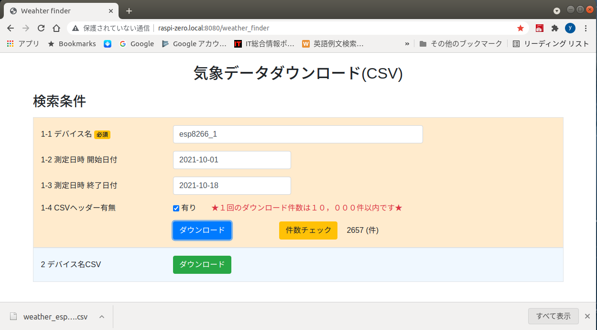

# ラズベリーパイによる家庭用気象データ監視システム

* Raspberry Pi Zero WH にヘッドレスOS(**Raspberry Pi OS Lite**)をインストールする方法
* 乾電池駆動の気象センサーモジュールの組み立てと間欠運転方法
* １６×８マトリクスＬＥＤドライバモジュールで４個の７セグ４桁ＬＥＤにデータを出力する方法
* Python GPIOアプリ、Flaskアプリをラズパイ起動時に自動実行する方法
* 各種アプリケーション用のインストーラーの作り方


## 1.家庭用気象データ監視システムの構成
---
* 1-1.ESP気象センサーモジュール
  * 1-1.(A). ESP気象センサー(ESP-WROOM-02 + BME280センサー)
  * 1-1.(B). 外気温測定用センサー (サーミスタ)
* 1-2.Raspberry Pi Zero WH
  * 1-2.(A) 気象データ表示板 (pigpioアプリケーション)
  * 1-2.(B) 気象データCSVダウンロード (flask web アプリケーション)
* 1-3.気象データの可視化
  * Tkinter(Python) + Matplotlib

<div style="text-align:center;">

</div>
<br/>

### 1-1(A).ESP気象センサー

* ESP-WROOM-02 DIP化キット + 乾電池駆動安定化電源 + ADコンバータ + BME280センサー

<div style="text-align:center;">

</div>
<br/>

### 1-1(B). 外気温測定用センサー

* サーミスター + ワイヤー -> ESP気象センサーに接続

<div style="text-align:center;">

</div>
<br/>

### 1-2.気象データ表示板 (pigpioアプリケーション)

* Raspberry Pi Zero WH + 気象データ表示板

<div style="text-align:center;">

</div>
<br/>

* 気象データ表示板にラズパイを直付け (2022-08-31現在)  
  当初は上記のようにラズパイのピンヘッダーにピンソケットを繋いでいましたが、ピンソケットでは簡単に抜けてしまう問題がありました。  
  
<div style="text-align:center;">

</div>
<br/>

* 結局ラズパイは基板にネジで直付けすることにしました。ラインはピンヘッダーに直接半田付けしています。  

<div style="text-align:center;">

</div>
<br/>


### 1-3. 気象データCSVダウンロード (flask web アプリケーション)

* Flask Webアプリケーション

<div style="text-align:center;">

</div>
<br/>

### 1-4. 気象データの可視化

* Python GUIアプリ(Tkinter) + Matplotlib

<div style="text-align:center;">

</div>
<br/>

## 2.システム概要 
---

### 2-1. 気象センサーモジュール

* ESP-WROOM-02モジュール
* センサーから取得したデータを**10分間隔でUDPパケットとして**内部ネットワーク宛にブロードキャストする
* ブロードキャスト後**ディープスリープモードに移行する ※間欠運転**

  [**>>> 気象センサーモジュール (ESP-WROOM-02) の製作<<<** ページへ](esp_wroom_02/README.md#2-気象センサーモジュール-esp-wroom-02)


### 2-2. 気象データ表示板

* Raspberry Pi Zero WH: **Raspberry Pi OS Lite (ヘッドレスOS ※GUIのない軽量OS)**
* **気象センサーモジュールからのUDPバケットをPythonアプリで取得する**
  * 気象データとしてをSQLiteデータベースに記録する
  * 4桁7セグLEDに出力する (外気温, 室内気温, 室内湿度, 気圧)
* **UDPパケットが規定時間内に届かない場合の対応 ※電池切れ想定**
   * メロディー鳴動スクリプトをスレッドにてサブプロセスとして起動  
   **※結構大きい音なので室内にいる場合はかならず気づきます**
   * GMailメールアドレス宛にメッセージ通知をスレッドにてサブプロセスとして起動  
   **※外出時にスマホにメールが届くとだいたい気づきます**
* 電源OFFボタンによるラズパイのシャットダウン
  * シャットダウンスクリプトをシステムサービスに登録

  [**>>> 気象データ表示板 の製作 <<<** ページへ](raspi_zero/README.md#2-気象データ表示板の製作)

### 2-3. 気象データCSVダウンロード

* Flask Webアプリケーション
* SQLiteデータベースから気象データをCSV出力する

  [**>>> Flask Webアプリケーション <<<** ページへ](flask_web/README.md#2-flask-webアプリケーション)

### 2-4. 気象データの可視化

* TkinterによるGUIアプリ + Matplotlib
* ダウンロードしたCSVを読み込み、期間を指定してグラフを出力 (ファイル保存機能有り)

  [**>>> GUIアプリケーション(Tkinter)でMatplotlibのグラフを表示する方法 <<<** ページへ](learn_matplotlib/README.md#2-1-前提条件)

## 3.開発環境
---
* 開発機 OS: Ubuntu 18.04 LTS

### 3-1. 気象センサーモジュール (ESP-WROOM-02) アプリ作成

* **Visual studio code** on Ubuntu
* 拡張モジュール: **Platform IO**  
    **言語 C++ for Arduino**<br/>

### 3-2 ラズパイアプリ作成

* **統合IDE: PyCharm community edition for linux (無料)**
* Python仮想環境作成: ディレクトリ ~/py_venv
  * gpioアプリ用ライブラリ: py37_pigpio
    * pigpio (GPIO制御), pyserial (シリアル通信)  
      【Python IDE】pycharm community edition for linux.
  * Flask Webアプリ用ライブラリ: py37_webapp
    * flask (開発環境用), waitress (本番環境用)  
      【Code editor】Visual Studio code

```bash
    # 1.pigpioアプリ ※コーディング専用(実行不可)
    python3 -m venv py37_pigpio 
    . py37_pigpio/bin/activate 
    pip install -U pip            # pipの最新化
    pip install pigpio pyserial
    deactivate

    # 2.Flask webアプリ
    #  Flaskは開発環境専用 ※flaskを起動すると本番環境に使用しないようWARNINGが出力される
    #    * Environment: production
    #    WARNING: This is a development server. Do not use it in a production deployment.
    #    Use a production WSGI server instead.
    #  Waitress は本番環境用: なぜ必要なのかは下記URLの「Run with a Production Server」を参照
    #   https://flask.palletsprojects.com/en/2.0.x/tutorial/deploy/
    #    Deploy to Production
    #      Run with a Production Server
    python3 -m venv py37_webapp
    . py37_webapp/bin/activate
    pip install -U pip
    pip install flask waitress
    deactivate
```

## 4.実機・運用
---

* Raspberry Pi Zero WH
    * 気象データ表示板:  
      * 16×8マトリクスLEDドライバモジュール: HT16K33
      * 電池切れ警告用メロディースピーカ  
      * 電源OFF回路(LED点滅)
    (参考書籍) ⑤  
    * データベース: SQLite3
    * pigpiodサービス (システムサービス)
    * UDPパケットモニタリングサービス: gpioアプリ (システムサービス)
    * 電源OFFサービス: gpioアプリ (システムサービス)
    * Flask webアプリサービス: waitress (システムサービス)
    * 気象データCSV出力バッチ: bashスクリプト  
<br/>
* 気象データモジュール: UDPパケット出力
    * Wi-Fiモジュール ESP-WROOM-02 DIP化キット
    * 室内気温・湿度・気圧測定： BME280センサー
    * 外気温測定: サーミスタ
    * A/Dコンバータ
    * 安定化電源モジュール
<br/><br/>
  * 気象センサーUDPバケットモニタリングシステム
    * OS: CentOS stream 8 ※公開サーバ (365日稼働)
    * データベース: SQLite3
    * python仮想環境 (py37_pigpio): pipでのインストールなし ※標準ライブラリのみ使用
    * システムサービス: local-udp-mon.service

## 5.インストール
---

### 5-1 Rapberry Pi OS Lite イメージをダウンロード

<https://downloads.raspberrypi.org/raspios_lite_armhf/images/raspios_lite_armhf-2021-05-28/>

ZIPファイル[**2021-05-07-raspios-buster-armhf-lite.zip**]をクリックしてダウンロード

### 5-2. 未フォーマットのSDカードをUSBに挿入しデバイスのマウント先をチェックする  

```bash
$ lsblk -e7    # --exclude major-numbers 7
NAME                    MAJ:MIN RM   SIZE RO TYPE MOUNTPOINT
sda                       8:0    0 931.5G  0 disk 
└─sda1                    8:1    0 931.5G  0 part 
  ├─ubuntu--vg-root     253:1    0 930.4G  0 lvm  /
  └─ubuntu--vg-swap_1   253:2    0   976M  0 lvm  [SWAP]
sdb                       8:16   0   931G  0 disk 
├─sdb1                    8:17   0   500G  0 part 
│ └─vg--vol01-vol01--lv 253:0    0   600G  0 lvm  /mnt/vol01-lv
├─sdb2                    8:18   0   180G  0 part 
│ └─vg--vol01-vol01--lv 253:0    0   600G  0 lvm  /mnt/vol01-lv
└─sdb3                    8:19   0   251G  0 part 
sdc                       8:32   1  29.1G  0 disk 
sr0                      11:0    1  1024M  0 rom  
```

### 5-3. ZIPフアイル(イメージアーカイブ)をSDカードに書き込む  
(参考URL) [Copying a zipped image to the SD card]  
https://www.raspberrypi.com/documentation/computers/getting-started.html#installing-images-on-linux  

```bash
$ unzip -p 2021-05-07-raspios-buster-armhf-lite.zip | sudo dd of=/dev/sdc bs=4M conv=fsync
[sudo] yukio のパスワード: 
0+28607 レコード入力
0+28607 レコード出力
1874853888 bytes (1.9 GB, 1.7 GiB) copied, 215.476 s, 8.7 MB/s

# 書き込み後のSDカードの確認: sdc1がbootパーティション
$ lsblk -e7
...
sdc                       8:32   1  29.1G  0 disk 
├─sdc1                    8:33   1   256M  0 part 
└─sdc2                    8:34   1   1.5G  0 part 
```

### 5-4. bootパーティション(/dev/sdc1)をローカルディスクに書き込みモードでマウントする
```bash
$ sudo mount --rw /dev/sdc1 /mnt/sdcard  # マウント先は事前に作成済みとする
$ cd /mnt/sdcard
```

### 5-5. WiFi設定情報ファイルをbootパーティションに書き込む  
(参考URL) Raspberry Pi WiFi Setup in Headless Mode  
https://raspberryexpert.com/raspberry-pi-wifi-setup/
 
(参考URL) Adding the Network Details to your Raspberry Pi  
https://www.raspberrypi.com/documentation/computers/configuration.html

```bash
$ sudo vi wpa_supplicant.conf
$ cat wpa_supplicant.conf 
ctrl_interface=DIR=/var/run/wpa_supplicant GROUP=netdev
update_config=1
country=JP

network={
   ssid="your ssid"  # Wi-Fiルータの情報に合わせる
   psk="your psk"
   key_mgmt=WPA-PSK
}
```

### 5-6. SSHログインを有効にするファイルを書き込む  
(参考URL) Method #1: Enable SSH in Headless mode  
https://raspberryexpert.com/ssh-into-raspberry-pi/

```bash
$ sudo touch ssh

$ ls -lrt 
... 省略 ...
-rwxr-xr-x 1 root root    1784  5月  7 23:43 config.txt
-rwxr-xr-x 1 root root     145  5月  8 00:00 issue.txt
-rwxr-xr-x 1 root root     169  5月  8 00:00 cmdline.txt
-rwxr-xr-x 1 root root     165 11月  1 14:56 wpa_supplicant.conf # ADD
-rwxr-xr-x 1 root root       0 11月  1 15:47 ssh                 # ADD

# SDカードを取り出す
$ cd ..
$ sudo umount /mnt/sdcard
```

### 5-7. インストール準備
* 最低限必要なもの  
ディスプレイモニター: DHCPから割り当てられたIPアドレス(2つ割り当てられる)を見るため

* あったほうがいいもの  
  有線ネットワークケーブル: 最新版に更新する時に Wi-Fi だと相当時間がかかる

* 不要なもの  
  キーボード: SSHでログインしインストール後の設定を実行するため使わない  
  マウス: [Rapberry Pi OS Lite]はヘッドレスOS(None GUI)なので使えない  


### 5-8. Raspberry Pi Zero WH にインストールする
* SDカードをカードスロットにセットして電源をいれる
* 画面中の [My IP address is xxx.xxx.xxx.xxx yyy.yyy.yyy.yyy]を見つける

<div style="text-align:center;">

</div>

- 開発PCからSSHでログインする: パスワード "raspberry"  
https://www.raspberrypi.com/documentation/computers/getting-started.html#installing-images-on-linux
```
You can now insert the SD card into the Raspberry Pi and power it up. For Raspberry Pi OS, if you need to manually log in, the default user name is pi, with password raspberry,
and the default keyboard layout is set to United Kingdom (UK).

You should change the default password straight away to ensure your Raspberry Pi is secure.
```

- パスワードを変更する
```bash
# 開発PC側: 画面表示のIPアドレスでSSHログイン ※IPアドレスは実行環境によって異なる
$ ssh pi@192.168.0.17

# ラズパイ側
pi@raspberrypi:~ $ passwd
Changing password for pi.
Current password:            # "raspberry"
New password: 
Retype new password: 
passwd: password updated successfully
# 一旦ログアウト、再度ログインする
pi@raspberrypi:~ $ exit

# 開発PC側
logout
Connection to 192.168.0.17 closed.
```
<div style="text-align:center;">

</div>
<br />

### 5-9. OSの最新化  
    (参考URL) Upgrading from Operating System Versions  
    https://www.raspberrypi.com/documentation/computers/os.html

```bash
# 本システムはOSのバージョン依存がないのでインストール時点の最新版にアップグレード(dist-upgrade)
pi@raspberrypi:~ $ sudo apt update && sudo apt -y dist-upgrade
# リブート
pi@raspberrypi:~ $ sudo reboot
```

## 6. Raspberry Pi Zero(WH) のコンフィグレーション
### 6-1. 固定IPアドレス設定(/etc/dhcpcd.conf)
```bash
$ sudo vi /etc/dhcpcd.conf

(オリジナル)
# Example static IP configuration:
#interface eth0
#static ip_address=192.168.0.10/24
#static ip6_address=fd51:42f8:caae:d92e::ff/64
#static routers=192.168.0.1
#static domain_name_servers=192.168.0.1 8.8.8.8 fd51:42f8:caae:d92e::1
# It is possible to fall back to a static IP if DHCP fails:
# define static profile
#profile static_eth0
#static ip_address=192.168.1.23/24
#static routers=192.168.1.1
#static domain_name_servers=192.168.1.1

(編集後)
# 有線LAN設定 ※固定IPアドレスは利用者ルーターの設定に合わせる
# define static profile
interface eth0
static ip_address=192.168.0.14/24
static routers=192.168.0.1
static domain_name_servers=192.168.0.1 # 8.8.8.8 fd51:42f8:caae:d92e::1
```

6-1-2. Wi-Fiの禁止(/boot/config.txt)
```bash
#/boot/overlays/README
# ...
# Name:   disable-wifi
# Info:   Disable onboard WiFi on Pi 3B, 3B+, 3A+, 4B and Zero W.
# Load:   dtoverlay=disable-wifi
# Params: <None>

sudo vi /boot/config.txt
# 追記
dtoverlay=disable-wifi
```

### 6-2. ホスト名の変更
```bash
pi@raspberrypi:~ $ sudo raspi-config
```

* 1 System Options
  - S4 Hostname: "raspberrypi" ⇒ "raspi-zero"

### 6-3. インターフェース設定  
* 3 Interface Options
  - P4 SPI                 : SPIインターフェース有効
  - P5 I2C                 : I2Cインターフェース有効
  - P6 Serial Port         : シリアルポートの用途変更  
    Login shell **No**, Serial port hardware **enable**
    ```
    # P6 設定により /etc/config.txt内に下記が追加される
    enable_uart = 1
    ```

### 6-4. ロケール/タイムゾーン設定  
* 5 Localization Options
  - L1 Locale              : "en_GB.UTF-8" -> "ja_JP.UTF-8"
  - L2 Timezone            : "Asia/Tokyo" ※データベースのローカルタイムスタンプに影響

### 6-6. Serialポートの用途変更  
* シリアルコンソール ⇒ シリアルインターフェース(UART)
```bash
pi@raspi-zero:~ $ ls -l /dev | grep serial
lrwxrwxrwx 1 root root           5 11月 16 20:31 serial0 -> ttyS0    # Primary
lrwxrwxrwx 1 root root           7 11月 16 20:31 serial1 -> ttyAMA0  # Secondary

# Bluetooth不可: 'dtoverlay=disable-bt'を追加する
pi@raspi-zero:~ $ sudo vi /boot/config.txt
pi@raspi-zero:~ $ cat /boot/config.txt | grep ^dtoverlay=
dtoverlay=disable-wifi
dtoverlay=disable-bt    # 追加する
dtoverlay=vc4-fkms-v3d

# BluetoothモデムがUARTに接続しないように当該サービスを使用不可に設定
pi@raspi-zero:~ $ sudo systemctl disable hciuart.service 
Removed /etc/systemd/system/multi-user.target.wants/hciuart.service.
# リブート
pi@raspi-zero:~ $ sudo reboot
```

#### 6-6-1. Serialポート変更確認

```bash
# Primary 
pi@raspi-zero:~ $ ls -l /dev | grep serial
lrwxrwxrwx 1 root root           7 11月 16 20:49 serial0 -> ttyAMA0  # Primary
lrwxrwxrwx 1 root root           5 11月 16 20:49 serial1 -> ttyS0    # Secondary
```

## 7. ラズパイにアプリケーションをインストールする
---

アプリケーション用のインストーラーを作る

### 7-1. インストーラーに必要なファイル

* [**installer**] ディレクトリに必要なファイルをまとめました

#### 7-1-1. **pigpioアプリ用**ファイル群

* [installer/**raspi_pigpio**] ディレクトリ


```
├ bin
│ ├ pigpio
│ │ ├ ... 一部省略 ...
│ │ ├ UDPClientFromWeatherSensor.py          # Pythonアプリケーシ本体
│ │ ├── conf                               # アプリ用設定ファイルディレクトリ
│ │ │   ├── conf_udpmon.json              # アプリ用設定ファイル
│ │ │   ├── ... 一部省略 ...
│ │ │   └── logconf_service_weather.json  # ログ出力設定ファイル
│ │ ├── db                                 # DB用ライブラリディレクトリ ※Webアプリも参照
│ │ │   ├── __init__.py
│ │ │   ├──  ... 一部省略 ...
│ │ │   └── weatherdb.py
│ │ ├── lib                                # GPIO用制御ライブラリディレクトリ
│ │ │   ├── __init__.py
│ │ │   ├── ht16k33.py
│ │ │   ├──  ... 一部省略 ...
│ │ │   └── mcp3000spidev.py
│ │ ├── log                                # ログ出力ライブラリディレクトリ
│ │ │   ├── __init__.py
│ │ │   └── logsetting.py
│ │ ├── mail                               # Gmail送信ライブラリディレクトリ
│ │ │   ├── __init__.py
│ │ │   └── gmail_sender.py
│ │ └── util                               # ユーティリィティライブラリディレクトリ
│ │     ├── __init__.py
│ │     └── file_util.py
│ ├ . 一部省略 ...
│ └ udpclient_from_weather_sensor.sh          # サービス用シェルスクリプト
├── db
│   └── weather_db.sql                      # DBのテーブル生成用SQLファイル
├── inst_main.sh                             # pigpioアプリ用インストーラーファイル
├── logs
│   └── pigpio                              # アプリ用ログ出力ディレクトリ
```

#### 7-1-2. インストールに必要な周辺ファイル (workディレクトリに配置)

```
└ work
  ├ add_env_in_bashrc.txt                # 環境変数ファイル
  ├ docs                                 # プロジェクトファイルのツリードキュメント
  │ ├ project_pigpio_tree.txt
  │ └ project_webapp_tree.txt
  ├ etc
  │ ├ default
  │ │ ├ switch-to-poweroff             # Shutdown service用環境変数
  │ │ └ udp-weather-mon                # UDP気象センサーデータモニタサービス用環境変数
  │ └── systemd
  │   └─ system
  │     ├ switch-to-poweroff.service    # Shutdown serviceファイル
  │     ├ udp-weather-mon.service       # UDP気象センサーデータモニタサービスファイル
  │     └ webapp-weather-finder.service # Webアプリサービスファイル
  └ py_venv
    ├ requirements_pigpio.txt            # pigpioアプリ Python 仮想環境用 Requrements ファイル
    └ requirements_webapp.txt            # Web アプリ Python 仮想環境用 Requrements ファイル
```

#### 7-1-3. 本番用環境変数ファイル [add_env_in_bashrc.txt]<br/>

* ユーザ**pi**の [.bashrc] ファイルの末尾に追記する ※インストーラーで実施

```bash
# Weather DB path
export PATH_WEATHER_DB=${HOME}/db/weather.db
export PATH_LOGGER_CONF=${HOME}/bin/pigpio/conf
# Web app path 
export PATH_WEBAPP=${HOME}/webapp
export PATH_WEBAPP_LOGS=${PATH_WEBAPP}/logs
# GMail info
export GMAIL_USER=[your address]@gmail.com
# Google Application password for 2 factor authenticate
export GMAIL_PASSWD=[your password for Raspi]
```

- (参考) 開発機(Ubuntu)の環境変数 [~/.bachrc] <br>
※**Gmailのパスワードはラズパイとは別に開発機用にも取得する必要がある**

```bash
# Weather DB path
export PATH_RASPI_BASE=$HOME
export PATH_WEATHER_DB=$PATH_RASPI_BASE/db/weather.db 
export PATH_LOGGER_CONF=$PATH_RASPI_BASE/bin/pigpio/conf 
export PATH_APP_LOGS=$PATH_RASPI_BASE/logs/pigpio 
# Web app path
export PATH_WEBAPP=~/project/VSCProjects/flask_apps/WeatherFinder
export PATH_WEBAPP_LOGS=$PATH_RASPI_BASE/webapp/logs
# GMail info
export GMAIL_USER=[your address]@gmail.com
export GMAIL_PASSWD=[your password for develop pc]
```

#### 7-1-4. アプリをサービス化するために必要なファイル ※環境変数、引数を定義する例

  - 1.環境変数ファイル [work/etc/default/udp-weather-mon] ※変数を使わない場合は不要。
     - (1) 環境変数として定義
     - (2), (3) シェルスクリプトの引数
```
PATH_WEATHER_DB=/home/pi/db/weather.db                                            (1)
UDP_PORT=2222                                                                     (2)
BRIGHTNESS_PIN=17                                                                 (3)
```

   - 2.サービスファイル本体 [work/etc/systemd/system/udp-weather-mon.service]
     - (1) コメントはシステムログに出力されるのでわかりやすく
     - (2) OSが起動してからアプリを起動する(シャットダウンするまで動作し続ける)場合 **simple** でOK
     - (3) シェルスクリプトに引数がある場合の例 (**$UDP_PORT, $BRIGHTNESS_PIN**)
     - (4) 環境変数ファイルへの**絶対パス**
     - (5) 実行ユーザは**pi**
     - (6) 通常この記述でOK

```
[Unit]
Description=UDPClient Weather data monitor service                                 (1)

[Service]
Type=simple                                                                        (2)
ExecStart=/home/pi/bin/udpclient_from_weather_sensor.sh $UDP_PORT $BRIGHTNESS_PIN  (3)
EnvironmentFile=/etc/default/udp-weather-mon                                       (4)
User=pi                                                                            (5)

[Install]
WantedBy=multi-user.target                                                         (6)
```

### 7-2-1. **pigpioアプリ用**のインストーラーを作る
---
- [ **inst_main.sh** ]
  - (1) 環境変数を ユーザ**pi**の **.bashrc** の末尾に追加
  - (2) OSのアップデート・アップグレード
  - (3) Python仮想環境プログラム、SQLiteデータベース、pigpioサービス・i2cツール等のインストール
  - (4-1) - (4-7) pigpioアプリ用 Python仮想環境の作成と、Requirements.txtからライブラリをインストール
  - (5) 環境変数を読み込み ※データベースディレクリパス
  - (6) データベースとテーブル作成
  - (7) cron
  - (8) pigpioサービスを有効に設定
  - (9) アプリ用サービスファイルを所定のディレクリにコピーしサービスを有効に設定する<br>
 ※ **(2), (3), (7), (8)はsudo権限での実行が必要**<br/>
     **echo $my_passwd |** sudo **--stdin [ or -S ]***<br/>
 ※ **引き続きWebアプリをインストールするのでリブートしない**

```bash
#!/bin/bash

# execute before export my_passwd=xxxxxx

# add application environ values to .bashrc
cat ~/work/add_env_in_bashrc.txt >> ~/.bashrc                                             (1)

echo $my_passwd | sudo --stdin apt update && sudo apt -y upgrade                          (2)
# headless os not installed.
echo $my_passwd | sudo --stdin apt -y install python3-venv sqlite3 pigpio i2c-tools tree  (3)

# Create Virtual Python environment.
mkdir py_venv                                                                              (4-1)
cd py_venv                                                                                 (4-2)
python3 -m venv py37_pigpio                                                                (4-3)
. py37_pigpio/bin/activate                                                                 (4-4)
pip install -U pip                                                                         (4-5)
pip install -r ~/work/py_venv/requirements_pigpio.txt                                      (4-6)
deactivate                                                                                 (4-7)
cd ~/

# load PATH_WEATHER_DB
. ~/work/add_env_in_bashrc.txt                                                             (5)
# Create weather database and tables by SQLite3
echo "Database file: $PATH_WEATHER_DB"
sqlite3 $PATH_WEATHER_DB < ~/db/weather_db.sql                                             (6)

# cron: remove application logs every days
echo $my_passwd | sudo --stdin cp ~/work/crontab/pi /var/spool/cron/crontabs/              (7)

# Enable pigpiod.service
echo $my_passwd | sudo --stdin systemctl enable pigpiod.service                            (8)

# Enable application services                                                              (9)
echo $my_passwd | { sudo --stdin cp ~/work/etc/default/switch-to-poweroff /etc/default
  sudo cp ~/work/etc/default/udp-weather-mon /etc/default
  sudo cp ~/work/etc/systemd/system/switch-to-poweroff.service /etc/systemd/system
  sudo cp ~/work/etc/systemd/system/udp-weather-mon.service /etc/systemd/system
  sudo systemctl enable udp-weather-mon.service
  sudo systemctl enable switch-to-poweroff.service
}
echo "Done."
```

### 7-2-2. **Webアプリ用**のインストーラーを作る
---

[installer/**raspi_webapp**]

- [ **inst_webapp.sh** ]
  - (1)-(5) **http://** でアクセスするためのホスト名を作成し /etc/hostsに追加<br/>
・ラズパイのインストール時のホスト名: **raspi-zero**<br/>
・Webアプリにアクセスするホスト名**raspi-zero.local**<br/>
[アクセス例] http://raspi-zero.local:8080/[アプリパス]
  - (6-1) - (6-6) Webアプリ用 Python仮想環境の作成と、Requirements.txtからライブラリをインストール
  * (7) Webアプリから pigpioアプリのデータベース用ライブラリを参照するためシンボリックリンクを作成
  * (8) アプリ用サービスファイルを所定のディレクリにコピーしサービスを有効に設定する<br>
  * (9) アプリ用サービスファイルを所定のディレクリにコピーしサービスを有効に設定する<br>
 ※ **(5), (8), (9) はsudo権限での実行が必要**<br/>

```bash
#!/bin/bash

# execute before export my_passwd=xxxxxx

# Add webapp host in hosts
ip_addr=$(ifconfig eth0 | grep "inet " | awk '{ print $2 }')              (1)
local_host=$(cat /etc/hosts | grep 127.0.1.1 | awk '{ print $2 }')        (2)
local_host="${local_host}.local"                                          (3)
add_host="${ip_addr}  ${local_host}"                                      (4)
echo $my_passwd | { sudo --stdin chown pi.pi /etc/hosts                   (5)
  sudo echo $add_host>>/etc/hosts
  sudo chown root.root /etc/hosts
}

# Create Virtual Python environment.
cd py_venv                                                                (6-1)
python3 -m venv py37_webapp                                               (6-2)
. py37_webapp/bin/activate                                                (6-3)
pip install -U pip                                                        (6-4)
pip install -r ~/work/py_venv/requirements_webapp.txt                     (6-5)
deactivate                                                                (6-6)
cd ~/

# make soft link db
cd webapp/weather_finder
ln -s ~/bin/pigpio/db db                                                  (7)
cd ~/

# Enable webapp service
echo $my_passwd | {                                                       (8)
  sudo --stdin cp ~/work/etc/systemd/system/webapp-weather-finder.service /etc/systemd/system
  sudo systemctl enable webapp-weather-finder.service
}

echo "Done."

echo $my_passwd | sudo --stdin reboot                                      (9)
```


### 7-3 アプリケーションをアーカイブする

- tar コマンドでアーカイブする 

```bash
# pigpio用アーカイブ
~raspi_pigpio$ tar czvf ../raspi_pigpio.tar.gz inst_main.sh bin db logs work
# Flask Web用アーカイブ
~raspi_webapp$ tar czvf ../raspi_webapp.tar.gz inst_webapp.sh webapp
```


### 7-4. アプリケーションアーカイブをラズパイにコピー

* **scp** コマンドでラズパイの **/home/pi** ディレクトリにコピーする
```bash
# 開発PC側
$ ls -l
合計 88
-rw-rw-r-- 1 yukio yukio 23757 11月 17 14:51 raspi_pigpio.tar.gz
-rw-rw-r-- 1 yukio yukio 64408 11月 16 18:20 raspi_webapp.tar.gz
# ラズパイにコピー
scp *.tar.gz pi@192.168.0.17:/home/pi
raspi_pigpio.tar.gz   100%   23KB   2.6MB/s   00:00    
raspi_webapp.tar.gz   100%   63KB   2.0MB/s   00:00  
```

### 7-5. アプリケーションアーカイブの解凍 (ラズパイ側)

* tar コマンドで解凍する

```bash
pi@raspi-zero:~ $ ls -l
合計 148
-rw-r--r-- 1 pi   pi   23757 11月 17 15:52 raspi_pigpio.tar.gz
-rw-r--r-- 1 pi   pi   64408 11月 17 15:52 raspi_webapp.tar.gz
# 解凍
pi@raspi-zero:~ $ tar xzf raspi_pigpio.tar.gz 
pi@raspi-zero:~ $ tar xzf raspi_webapp.tar.gz 
pi@raspi-zero:~ $ ls -l
合計 148
drwxr-xr-x 3 pi   pi    4096 11月  2 20:14 bin
drwxr-xr-x 2 pi   pi    4096 11月  2 20:14 db
-rwxr-xr-x 1 pi   pi    1270 11月 17 14:50 inst_main.sh
-rwxr-xr-x 1 pi   pi     924 11月  2 20:14 inst_webapp.sh
drwxr-xr-x 3 pi   pi    4096 11月  2 20:14 logs
-rw-r--r-- 1 pi   pi   23757 11月 17 15:52 raspi_pigpio.tar.gz
-rw-r--r-- 1 pi   pi   64408 11月 17 15:52 raspi_webapp.tar.gz
drwxr-xr-x 4 pi   pi    4096 11月  8 17:29 webapp
drwxr-xr-x 5 pi   pi    4096 11月 16 18:15 work
```

### 7-6. アプリケーションインストール

- ユーザ pi のパスワードを export する
- 最初に pigpioアプリインストーラー [inst_main.sh] を実行
- 引き続き Webアプリインストーラー [inst_webapp.sh] を実行 ※最後にリブートされる

```bash
# ユーザpiのパスワードをexport
pi@raspi-zero:~ $ export my_passwd=xxxxxx
# pigpioアプリのインストール
pi@raspi-zero:~ $ ./inst_main.sh 
... インストール時の出力が大量のため省略 ...
# webappアプリのインストール ※自動でリブート
pi@raspi-zero:~ $ ./inst_webapp.sh 
... インストール時の出力が大量のため省略 ...
```

### 7-7. アプリケーションサービス実行ステータス確認

* リブート後の各アプリケーションサービス

<div style="text-align:center;">

</div>
<br/>

* 各アプリケーションサービスが正常に起動したか確認する

```bash
pi@raspi-zero:~ $ sudo systemctl status udp-weather-mon.service 
● udp-weather-mon.service - UDPClient Weather data monitor service
   Loaded: loaded (/etc/systemd/system/udp-weather-mon.service; enabled; vendor preset: enabled)
   Active: active (running) since Wed 2021-11-17 16:27:20 JST; 1min 19s ago
 Main PID: 329 (udpclient_from_)
    Tasks: 3 (limit: 877)
   CGroup: /system.slice/udp-weather-mon.service
           ├─329 /bin/bash /home/pi/bin/udpclient_from_weather_sensor.sh 2222 17
           └─339 python /home/pi/bin/pigpio/UDPClientFromWeatherSensor.py --udp-port 2222 --brightness-pin 17

11月 17 16:27:20 raspi-zero systemd[1]: Started UDPClient Weather data monitor service.

pi@raspi-zero:~ $ sudo systemctl status switch-to-poweroff.service 
● switch-to-poweroff.service - Raspberry Pi poweroff service
   Loaded: loaded (/etc/systemd/system/switch-to-poweroff.service; enabled; vendor preset: enabled)
   Active: active (running) since Wed 2021-11-17 16:27:18 JST; 1min 31s ago
 Main PID: 280 (switch_to_power)
    Tasks: 3 (limit: 877)
   CGroup: /system.slice/switch-to-poweroff.service
           ├─280 /bin/bash /home/pi/bin/switch_to_poweroff.sh 21 20
           └─289 python /home/pi/bin/pigpio/SwitchToPoweroff.py --poweroff-pin 21 --ledblink-pin 20

11月 17 16:27:18 raspi-zero systemd[1]: Started Raspberry Pi poweroff service.
pi@raspi-zero:~ $ sudo systemctl status webapp-weather-finder.service 

● webapp-weather-finder.service - Flask webapp WeatherFinder service
   Loaded: loaded (/etc/systemd/system/webapp-weather-finder.service; enabled; vendor preset: enabled)
   Active: active (running) since Wed 2021-11-17 16:27:17 JST; 2min 41s ago
 Main PID: 271 (start.sh)
    Tasks: 6 (limit: 877)
   CGroup: /system.slice/webapp-weather-finder.service
           ├─271 /bin/bash /home/pi/webapp/start.sh prod >/dev/null
           └─370 python /home/pi/webapp/run.py

11月 17 16:27:17 raspi-zero systemd[1]: Started Flask webapp WeatherFinder service.
11月 17 16:27:24 raspi-zero start.sh[271]: raspi-zero.local with production
```

## 8. Webアプリを実行環境毎に切り替えるスクリプトの作り方
---
### 8-1. シェルスクリプト

* Webアプリ起動サービス[webapp-weather-finder.service] から実行部分を抜粋  
  ※引数は運用環境 "prod"  
  ExecStart=/home/pi/webapp/start.sh **prod** >/dev/null

* Webアプリ起動シェルスクリプト [start.sh]
  * (1) 引数無しのデフォルトは開発環境で起動
  * (2) 引数"prod"の場合は本番環境で起動
  * (3-1) - (3-2) ホスト名を"/etc/hostname"ファイルから取得しPythonスクリプトに引き渡す
  * (3-3) 実行時の環境をPythonスクリプトに引き渡す
  * (4-1) py37_webapp 仮想環境に入る
  * (4-2) pythonスタートアップスクリプト [run.py] を実行する
  * (5) シャットダウン時には仮想環境から抜ける
  
```bash
#!/bin/bash

# ./start.sh                    -> development
# ./start.sh prod | production  ->production
env_mode="development"                                 # (1)
if [ $# -eq 0 ]; then
    :
else
   if [[ "$1" = "prod" || "$1" = "production" ]]; then 
        env_mode="production"                          # (2)
   fi
fi

# Hostname is not resolved when this service starts (systemd-hostname.service)
#ip_host=$(/bin/hostname -I | awk '{ print $1 }')
#name_in_hosts=$(/bin/cat /etc/hosts | grep $ip_host | awk '{ print $2 }')
# /etc/hosts in following line
# xxx.xxx.xxx.xx myhost.local myhost -> myhost.local
host_name=''$(/bin/cat /etc/hostname)''                 # (3-1)
export IP_HOST="${host_name}.local"                     # (3-2)
export ENV=$env_mode                                    # (3-3)
echo "$IP_HOST with $ENV"

. ${HOME}/py_venv/py37_webapp/bin/activate              # (4-1)
python ${HOME}/webapp/run.py                            # (4-2)

deactivate                                              # (5)
```

### 8-2. Pythonスタートアップスクリプト

#### 8-2-1 シェルスクリプト実行時の環境変数の値により実行時サーバを切り替える [run.py]

* (1) app のインポートにより weather_finderディレクトリの \_\_init\_\_.py が先に実行される
* (2-1) 起動が本番環境かどうか判定
* (2-2) \_\_init\_\_.py (3) よりサーバ名(ホスト名 + ":" + ポート) を取得する
* (2-3)〜(2-4) ":" で分割し、ホスト名とポートを取得
* (3-A) 本番環境が指定された場合、Waitress (WSGIサーバ)を起動する
  * (3-A-1) 〜 (3-A-2) waitressをインポートしホスト名とポートを指定しサーバを起動  
  ※1 \_\_init\_\_.py (2-1) より ポート=8080 となる  
  ※2 (3-A-ex) フォールバック: デバックなしで起動
* (3-B) 開発環境の場合、Flask組込みのサーバをデバックモードで起動  
  ※ \_\_init\_\_.py (2-1) より ポート=5000 となる

```python
import os
from weather_finder import app, app_logger                           # (1)

"""
This module load after app(==__init__.py)
"""

if __name__ == '__main__':
    has_prod = os.environ.get("ENV") == "production"                  # (2-1)
    # app config SERVER_NAME
    srv_host = app.config["SERVER_NAME"]                              # (2-2)
    srv_hosts = srv_host.split(":")                                   # (2-3)
    host, port = srv_hosts[0], srv_hosts[1]                           # (2-4)
    app_logger.info("run.py in host: {}, port: {}".format(host, port))
    if has_prod:                                                      # (3-A)
        # Production mode
        try:
            # Prerequisites: pip install waitress
            from waitress import serve                                # (3-A-1)
            app_logger.info("Production start.")
            serve(app, host=host, port=port)                          # (3-A-2)
        except ImportError:                                           # (3-A-ex)
            # Production with flask,debug False
            app_logger.info("Development start, without debug.")
            app.run(host=host, port=port, debug=False)
    else:                                                              # (3-B)
        # Development mode
        app_logger.info("Development start, with debug.")
        app.run(host=host, port=port, debug=True)
```

#### 8-2-2 Webアプリ初期化 [weather_finder/\_\_init\_\_.py]

* (1) シェルスクリプトからOSのホスト名を取得
* (2) シェルスクリプトから実行環境 [本番 | 開発] を取得
* (2-A) 本番環境なら、ポート8080をホスト名に追記 ※Waitressサーバー用
* (2-B) 開発環境なら、ポート5000をホスト名に追記 ※Flask組込みサーバー用
* (3) アプリコンフィグにサーバーホスト名を設定 ※8-2-1 run.py で参照  
※ **OSのホスト名とサーバーに設定するホスト名を一致させることは重要です**

```python
import os
import uuid
from flask import Flask
from weather_finder.log import logsetting
from weather_finder.config import config_dict

app = Flask(__name__)
app_logger = logsetting.get_logger('app_main')
app.config.from_object('weather_finder.config')
app.config.from_pyfile(os.path.join(".", "messages/messages.conf"), silent=False)
app.secret_key = uuid.uuid4().bytes

# サーバホストとセッションのドメインが一致しないとブラウザにセッションIDが設定されない
IP_HOST = os.environ.get('IP_HOST', None)                       # (1)
has_prod = os.environ.get("ENV") == "production"                # (2)
if has_prod:
    # Production mode
    SERVER_HOST = IP_HOST + ":8080"                             # (2-A)
else:
    SERVER_HOST = IP_HOST + ":5000"                             # (2-B)

app.config["SERVER_NAME"] = SERVER_HOST                         # (3)
app.config["APPLICATION_ROOT"] = "/weather_finder"
# use flask jsonify with japanese message
app.config["JSON_AS_ASCII"] = False
app_logger.debug("app.secret_key: {}".format(app.secret_key))
app_logger.debug("{}".format(app.config))

# Application main program
from weather_finder.views import app_main
```

* 上記スクリプトにより、開発環境(Ubuntu) と本番環境(Raspberry Pi OS)を意識することなくWebアプリケーションを実行することができます。
<br/>

## 9. 参考図書
---
* ちゃんとしたシステムを作るにはインターネットだけの情報では無理です  
※私はJavaプロクラマーとして２０年近くやってきたので電子工作とラズパイは全くの素人
* 今回のシステムを作るにあたり写真に写っている書籍は多いに役立ちました
* インターネットではラズパイの公式サイト(英語)、Githubサイト、Stack Overflow は大変参考になりました

<div>

</div>
<br/>
