## 1. 気象センサーモジュール (ESP-WROOM-02) の参考書
---
* ①-A **超特急Web接続！ESPマイコン・プログラム全集**  
   基本的にはこの本のソースコードを参考にプログラム。  
   ※**間欠運転** の実装も掲載されているが、実際の実装は下記**書籍②の方法を採用**
* ①-B 上記書籍の**最新の配線が記載されたPDFドキュメント**  
   ※①-Aの著者サポートページからダウンロード  
   ※ESP-WROOM-02(ESP8266)モジュール実験用ボード (基本ボードA)を開発用基板に配線  
   ※4-5 ケチケチ運転術・基本ボード (B) をベースにユニバーサル基板に配線
* ② **IoT開発スタートブック**
  * 第４章 「低消費電力な端末を開発する」の"単純な間欠な動作の実装"の考え方を参考とする  
   ※但し、**この本の実装はESP-WROOM-32用のため、ESP-WROOM-02用に置き換えて実装**

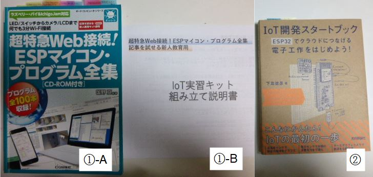

 

### 1-1. 書き込み用の開発ボードＡ

* ESP-WROOM-02 DIP化キットに書き込みを行う実験用ボード (開発ボードＡ)  
※ブレッドボードの場合、書き込み作業中に部品・配線が外れてしまうことがあります。  
　使い勝手が悪いので、下記 1-2. ユニバーサル基板に配線しました。

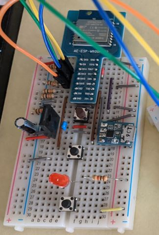

 

### 1-2. 改良した開発ボードＡ

* ブレッドボードに代わりにユニバーサル基板(ブレッドボード配線パターンタイプ)に配線。
* 出力電源(3.3V)、I2Cポート、SPIポートをボードの下左端にまとめたので使い勝手が向上しました。

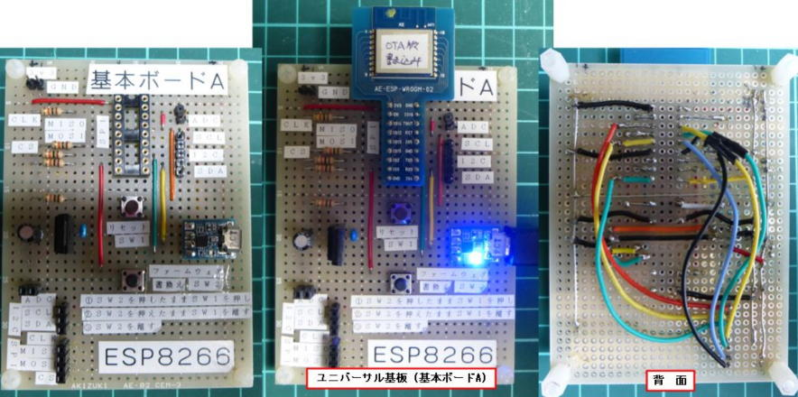

 

## 2. 気象センサーモジュール (ESP-WROOM-02) 
---

### 2-1. 書籍①-B の【4-5 ケチケチ運転術・基本ボード (B) 】

* ESP-WROOM-02 DIP化キット ＋ 安定化電源 ＋ 乾電池 (1.5V × 3本=4.5V) の配置

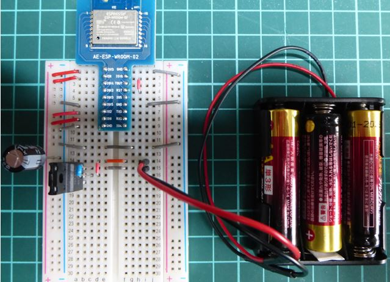

 

### 2-2. ブレッドボード上の気象センサーモジュールをユニバーサル基板に再現

* ブレッドボードと同じ配線のユニバーサル基板を使用したので、ブレッドボード上の配線を見ながらハンダ付けできます。
* 使用部品
  * ESP-WROOM-02 DIP化キット
  * レギュレータ 3.3V 500mA ＋ コンデンサー ＋ 抵抗
  * アナログコンバータ (MCP3002)
  * 気象センサー BME280 (気温・湿度・大気圧)
  * サーミスタ 

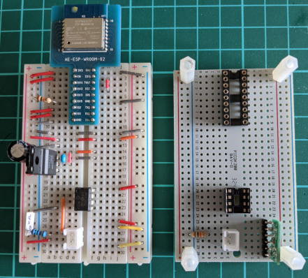

 

### 2-3. 電池モジュールと気象センサーモジュールの配線状況 (ウラ面)

* 電池モジュール：充電式ニッケル水素電池(1.2V × 4本=4.8V)。
* ウラ面： 配線がシンプルになっています。

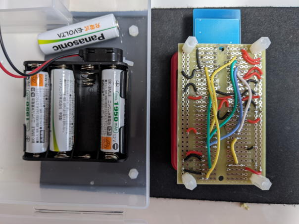

 

### 2-4. 完成した気象センサーモジュール

* 気象センサーモジュールとラズパイをシリアル接続したところ。

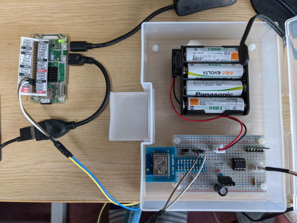

 

### 2-5. 気象センサーモジュールの動作確認

* ラズパイ側で気象センサーモジュールの動作確認 (シリアルログをtailコマンドで出力)  
※センサーデータ取得と**間欠運転 (Deep Sleep)** が正常に動作していることが確認できます。

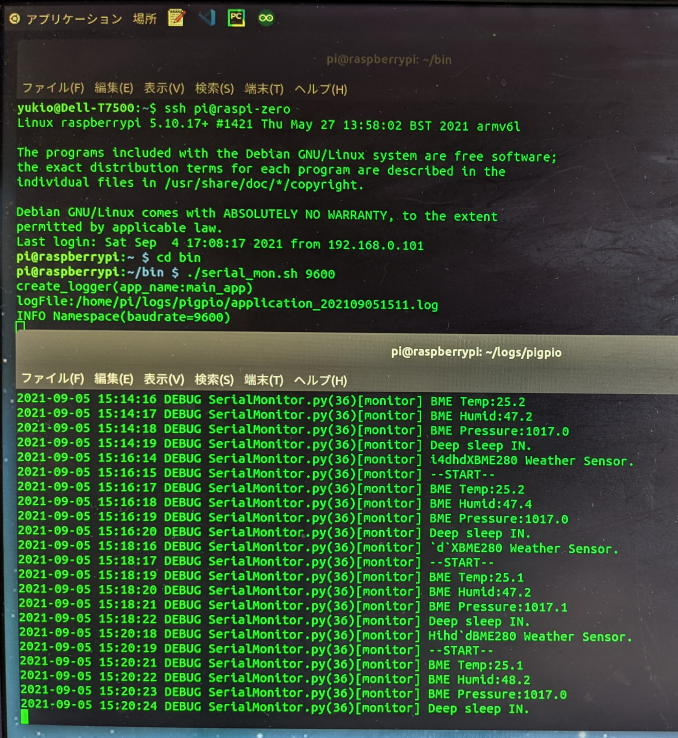

 

## 3. 気象センサーモジュール用のコード作成方法
---

### 3-1. PlatformIO プロジェクトホーム

* Visual Studio code + **PlatformIOプラグイン**  
※**Arduino IDEより格段に開発効率が良いです。**
* ブロジェクトの作成はホーム画面の [+New Project] から始めます。  

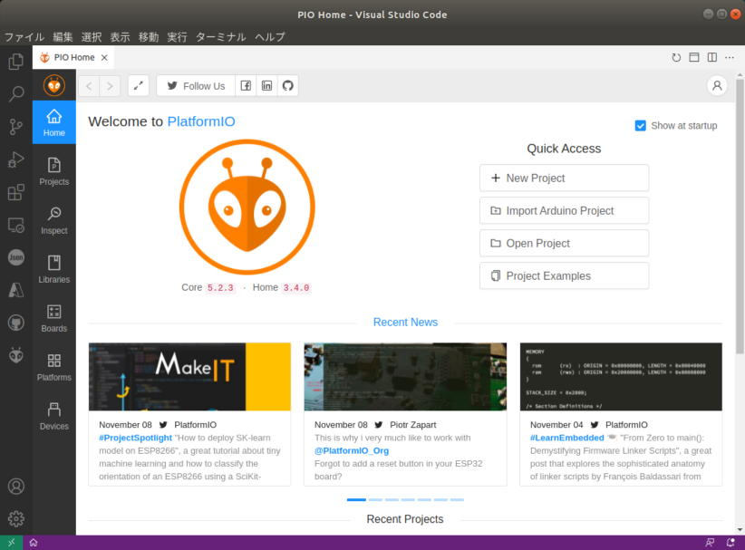

 

### 3-2. Project Wizard で プロジェクト名・使用ポード・フレームワークを指定

* Name：プロジェクト名のディレクトリが生成されます
* Board： コンボリストから **"ESP-WROOM-02 (Espressif)"** を選択します
* Framework: コンボリストから **"Arduino"** を選択します

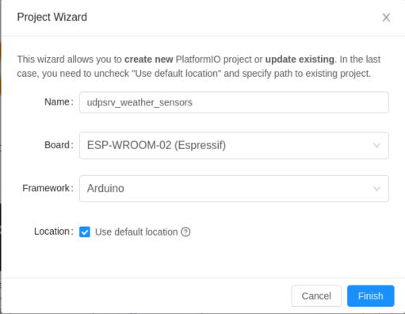

 

### 3-3-1. Locationの変更

* デフォルトの**ロケーションのチェックを外し**適切なプロジェクトディレクトに変更します  
※デフォルトでは**Documents配下のとんでもない深いディレクトリのなかに**作成されてしまいます。

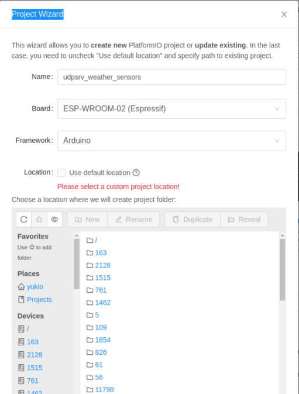

 

### 3-3-2. Locationを開発プロジェクト配下のディレクトリに変更

* 画面下の [Finish] ボタンを押下

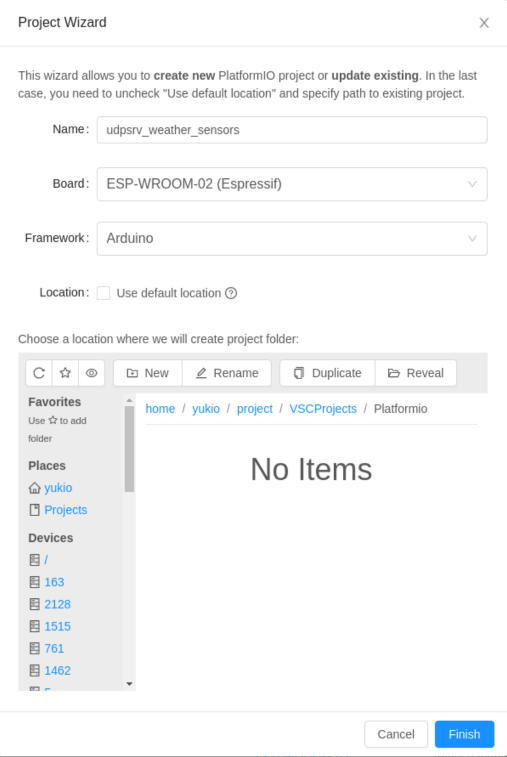

 

### 3-4. PlatformIOプロジェクトのIniファイルがプロジェクトトップに生成されます

 

### 3-5-1. ライブラリの追加

* PIO Home の [Libraries] タブを押下してライブラリ画面に切り替えします。

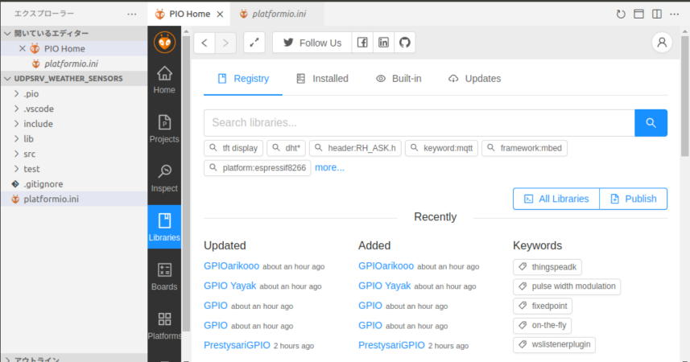

 

### 3-5-2. BEM280センサーライブラリの追加

* [Registory] タブのコンボボックスに "BME280" と入力すると、BME280センサー用ライブラリが表示さます。 
* Adafruit のライブラリを使用することにします。

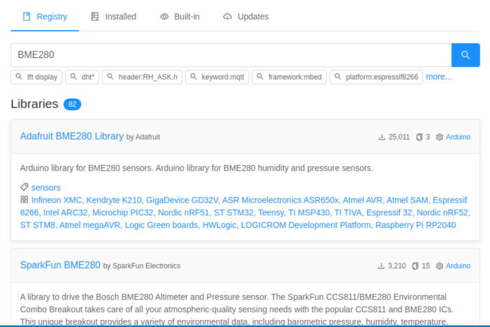

 

### 3-5-3. BEM280センサーライブラリの選択

* [Registory] タブのコンボボックスに "BME280" と入力すると、BME280センサー用ライブラリが表示さます。
* Adafruit BME280 Library を使用することにします。
* [Add to Project] ボタンを押下

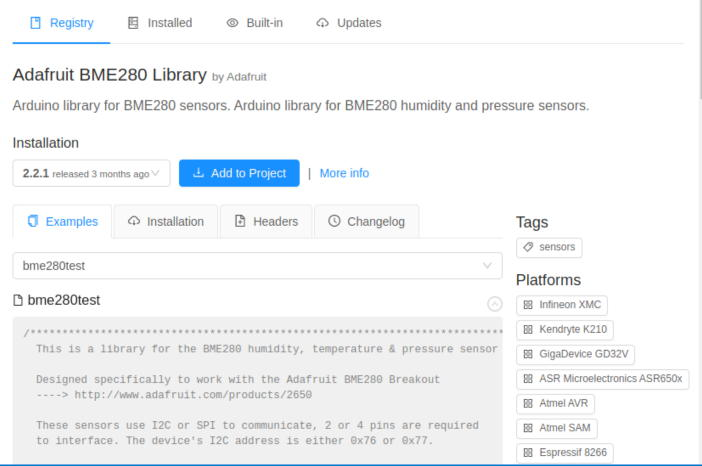

 

### 3-5-4. プロジェクトにライブラリを追加します

* ダイアログの [Add] ボタンを押下します。

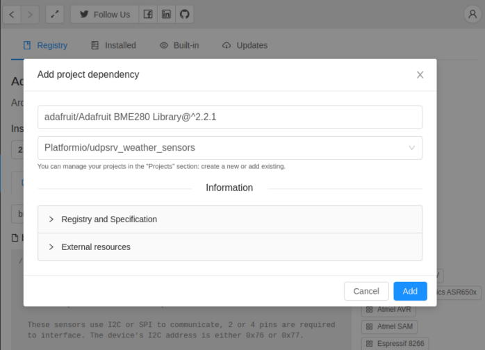

 

### 3-5-5. ＯＫボタンを押下しライブラリをプロジェクトに追加

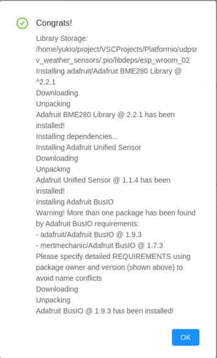

 

### 3-5-6. BMEライブラリのサンプロソースがプロジェクトに追加されます

* ファイ名を "main.cpp" にリネームして自分のプロジェクトに合わせコーディングします。

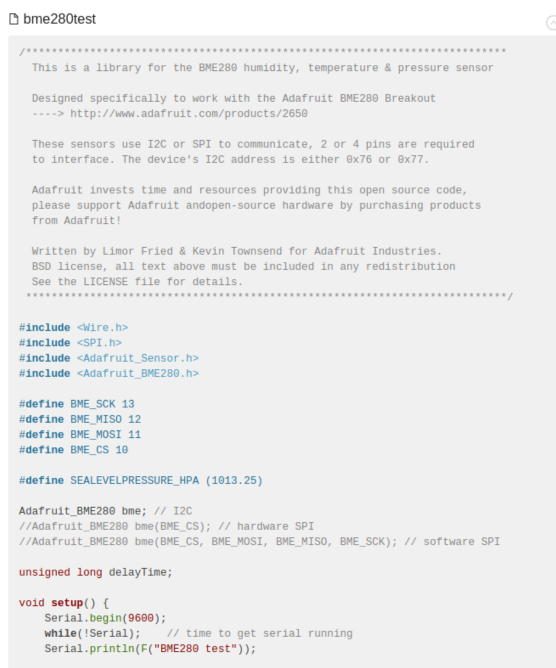

 

### 3-6. プロジェクトのビルド

* コーディングが完了したら、画面下のアイコン [ソースビルド] を押下します。
* ターミナルにビルドログが出力されます。

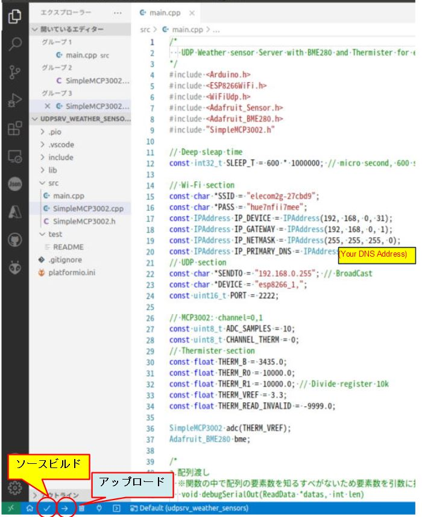

 

* ビルド開始。

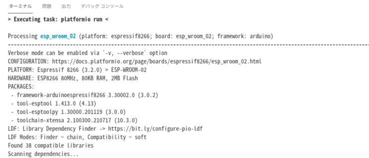

 

* ビルド完了。
* エラーがなければビルド後のバイナリを実機にアップロードします。

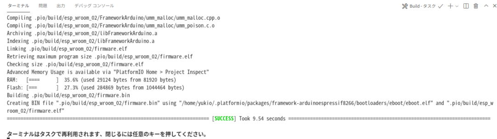

 

### 3-7. バイナリを実機にアップロード

* コーディングが完了したら、画面下のアイコン [アップロード] を押下します。

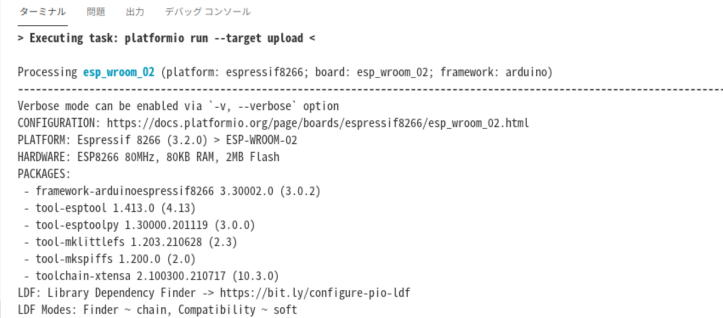

 

* エラーがなければアップロードが完了し、実機が直ちにプログラムを実行します。

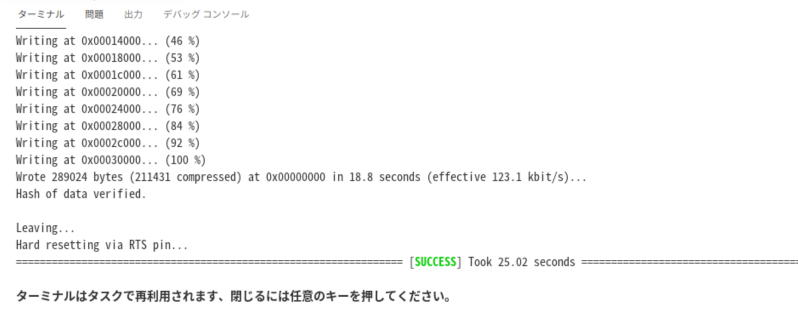

 

[**>>>トップベージ<<<** に戻る](../README.md#1-1a-esp気象センサーモジュール)