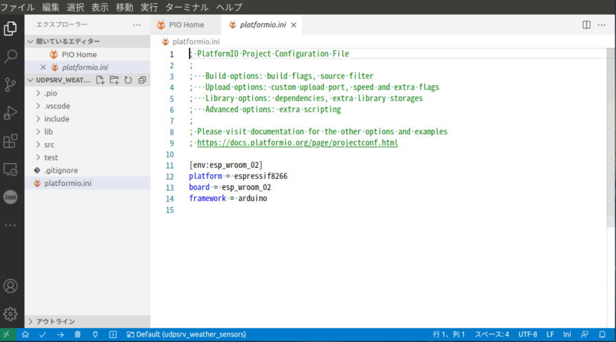

## 1. 気象センサーモジュール用のコード作成方法
---

### 1-1. PlatformIO プロジェクトホーム

* Visual Studio code + **PlatformIOプラグイン**  
※**Arduino IDEより格段に開発効率が良いです。**
* ブロジェクトの作成はホーム画面の [+New Project] から始めます。  

 

### 1-2. Project Wizard で プロジェクト名・使用ポード・フレームワークを指定

* Name：プロジェクト名のディレクトリが生成されます
* Board： コンボリストから **"ESP-WROOM-02 (Espressif)"** を選択します
* Framework: コンボリストから **"Arduino"** を選択します

 

### 1-3-1. Locationの変更

* デフォルトの**ロケーションのチェックを外し**適切なプロジェクトディレクトに変更します  
※デフォルトでは**Documents配下のとんでもない深いディレクトリのなかに**作成されてしまいます。

 

### 1-3-2. Locationを開発プロジェクト配下のディレクトリに変更

* 画面下の [Finish] ボタンを押下

 

### 1-4. PlatformIOプロジェクトのIniファイルがプロジェクトトップに生成されます

 

### 1-5-1. ライブラリの追加

* PIO Home の [Libraries] タブを押下してライブラリ画面に切り替えします。

 

### 1-5-2. BEM280センサーライブラリの追加

* [Registory] タブのコンボボックスに "BME280" と入力すると、BME280センサー用ライブラリが表示さます。 
* Adafruit のライブラリを使用することにします。

 

### 1-5-3. BEM280センサーライブラリの選択

* [Registory] タブのコンボボックスに "BME280" と入力すると、BME280センサー用ライブラリが表示さます。
* Adafruit BME280 Library を使用することにします。
* [Add to Project] ボタンを押下

 

### 1-5-4. プロジェクトにライブラリを追加します

* ダイアログの [Add] ボタンを押下します。

 

### 1-5-5. ＯＫボタンを押下しライブラリをプロジェクトに追加

 

### 1-5-6. BMEライブラリのサンプロソースがプロジェクトに追加されます

* ファイ名を "main.cpp" にリネームして自分のプロジェクトに合わせコーディングします。

 

### 2-1. プロジェクトのビルド

* コーディングが完了したら、画面下のアイコン [ソースビルド] を押下します。
* ターミナルにビルドログが出力されます。

 

* ビルド開始。

 

* ビルド完了。
* エラーがなければビルド後のバイナリを実機にアップロードします。

 

### 2-2. バイナリを実機にアップロード

* コーディングが完了したら、画面下のアイコン [アップロード] を押下します。

 

* エラーがなければアップロードが完了し、実機が直ちにプログラムを実行します。

 

[**>>>トップベージ<<<** に戻る](../README.md#1-1a-esp気象センサーモジュール)