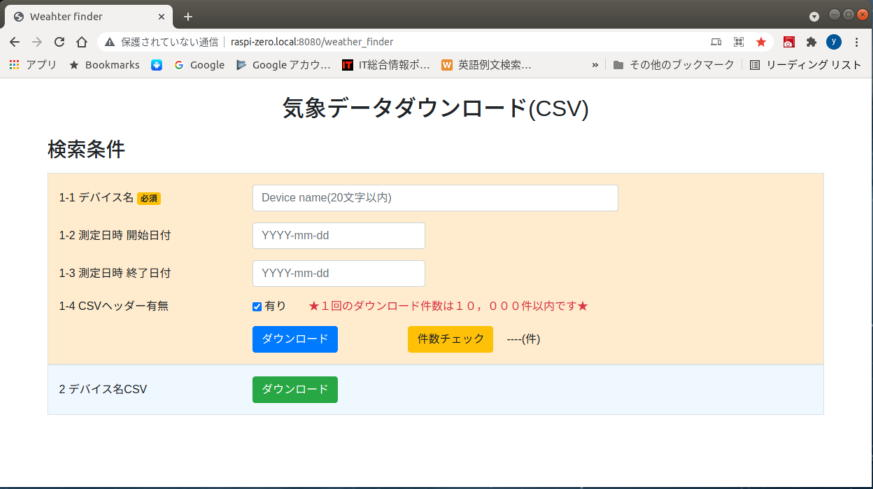

## 1. UdemyのWeb系アプリのEラーニングコース
---
Web画面系は**ほぼ素人**なので手っ取り早く学べるUdemyのEラーニングコースを受講しコース中のサンプルコードを参考にしました  
     ※英語のコースの場合はGithubでサンプルソース提供している場合があるのでサンプルソース見てから受講するかどうか判断するのも一つの方法だと思います

* (1) Flask: 「**The Ultimate Flask Course**」  
     英語のコースですが とにかく実用的なサンプルが豊富  
     コースの提供元は **Packt Publishing** でサンプルソースはGithubからダウンロードできます  
     <https://github.com/PacktPublishing/The-Ultimate-Flask-Course>  
   
* (2) Vue.js: A.[**超Vue.js 2 完全バック**]と B.[**Vue - The Complete Guide**]  
     ※1. 残念ながらA.のコースの場合、"Hello World"的なサンプルソースが多かったため、英語のコースで評価が高いコースも受講  
     ※2. B.の提供元も **Packt Publishing** でサンプルソースはGithubからダウンロードできます
     <https://github.com/PacktPublishing/Vue---The-Complete-Guide-incl.-Vue-Router-Vuex-and-Composition-API>-

<div style="text-align:center;">

</div>
<br/>

## 2. Flask Webアプリケーション

### 2-1. 気象データダウンロード(CSV)画面

Webフレームワーク: Flask(2.x) + Bootstrap(v4.x) + Vue.js(2.x)

* 画面は１画面(Vue.js含む)のみ。簡単な処理しかしていないためソースコードの説明は割愛

<div style="text-align:center;">

</div>
<br/>

#### 2-1-1. 処理内容

* 検索条件チェック  
  【ダウンロード】ボタン押下: POSTリクエストで**サーバーサイド側でチェック**実施  
  (1) デバイス名チェック: SQLインジェクション対応有り
  (2) 測定日付チェック: 日付妥当性チェック + SQLインジェクション対応有り
* 【件数チェック】ボタン: レコード件数の表示  
   **HTTP クライアントの axios のGETリクエストでサーバーサイド側で件数を返却**
* CSVダウンロード  
  (1) デバイス名CSV: 【ダウンロード】ボタン押下  
    ・チェック処理なしでダウンロードされたあと**リダイレクトにより初期画面に戻る**  
  (2) 気象データCSV: 【ダウンロード】ボタン押下  
    ・チェック処理で**エラーが無い場合、ダウンロードされリダイレクトにより初期画面に戻る**  
    ※1. 10,000件を超えてもダウンロードが可能だが数分から数十分以上かかる可能性がある  
    ※2. **ラズパイZeroは1コア・メインメモリ512MBの低スペックなマシンのため**、Web画面からのダウンロードも**件数が数万件を超えたあたりから相当時間かかるようになります**  
    ※3. バッチでのCSV出力を提供しており、リモートからラズパイにログインし**CSV出力バッチを実行したほうが圧倒的に早いです**  
    ※4. 実際には上記※3の実行でファイル保存したCSVを**scpコマンドなどでローカルマシンにコピーするような運用**現実的と思います  
    ※3. データベース処理のソースは [raspi_zero]プロジェクト側(src/bin/pigpio/db/配下)にあります

### 2-2. 気象データテーブルとダウンロードCSV

2-2-1. 気象データテーブル
```SQL
-- デバイス機器(IoT)テーブル
CREATE TABLE IF NOT EXISTS t_device(
    id INTEGER PRIMARY KEY AUTOINCREMENT,    -- デバイスID
    name VARCHAR UNIQUE NOT NULL             -- デバイス名
);

-- 気象データテーブル
CREATE TABLE IF NOT EXISTS t_weather(
    did INTEGER NOT NULL,                     -- デバイスID
    measurement_time INTEGER NOT NULL,        -- 観測時刻 (UNIXタイムスタンプ)
    temp_out real,                            -- 外気温
    temp_in real,                             -- 室内気温
    humid real,                               -- 室内湿度
    pressure real,                            -- 室内気圧
    PRIMARY KEY (did, measurement_time),
    FOREIGN KEY (did) REFERENCES t_devices (id) ON DELETE CASCADE
);
```

2-2-2. ダウンロードCSV ※両方共にヘッダ列有り

* (1) デバイスCSV: [ファイル名] device.csv  
 (出力例)
```
"id","name"
1,"esp8266_1"
``` 
* (2) 気象データCSV: [ファイル名] weather_デバイス名_YYYYmmDD(開始)_YYYYmmDD(終了).csv  
 (出力例) 測定間隔は10分毎  
```
"did","measurement_time","temp_out","temp_in","humid","pressure"
1,"2021-10-17 00:01:46",7.1,17.9,55.5,1005.8
1,"2021-10-17 00:11:30",6.8,17.9,55.3,1005.4
1,"2021-10-17 00:21:16",6.9,17.8,55.4,1005.3
```

[**>>>トップベージ<<<** に戻る](../README.md#2-3-気象データcsvダウンロード)
