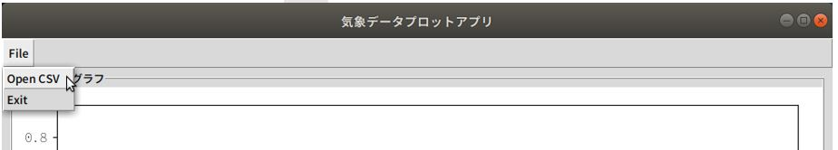

## 1. TkInterとmatplotlibに関する参考書
---
* ① 洋書ですがTkinterに関しては一番詳しいと思います  
  ※1. Amazonのkindel版を購入。  
  ※2. Packt publishingのGithubサイトからサンプルコードをダウンロードできます
* ② Matplotlibについては下記【章】の11.2 Matplotlibを参考にしました  
  【Chapter 11】環境データ監視システム (データ表示)  
* TkInterにMatploglibを表示する方法は本家サイト【Embedding in Tk】が元ネタになります  
 <https://matplotlib.org/3.1.1/gallery/user_interfaces/embedding_in_tk_sgskip.html>

<div style="text-align:center;">

</div>
<br/>

## 2. GUIアプリケーション(Tkinter)でMatplotlibのグラフを表示する方法
---
### 2-1. 前提条件

* (1) OS: Ubuntu 18.04 (又は20.04) 、python3 は **Python 3.7.x**  
※1 **2022年03月現在** Ubuntu 18.04、Ubuntu 20.04 のいずれも **python3.8.12** になっています。  
※2 Ubuntu 18.04で**python3.7.xの場合、python3-tkをインストールする**必要があります。  
※3(B) **python3.7.xをソースコードからビルドしそのpython3で実行する場合、python3-tkは不要**。  
※3(A) **python3.8.xの場合も、python3-tkは不要**。  

```
# ※2のケース
$ sudo apt update && apt -y install python3-tk
```

* (2) **プロジェクト専用のPython仮想環境を作り** matplotlib(**最新: 3.4.3**)をインストールする

```
$ python3 -m venv py37_learn_matplotlib
(py37_learn_matplotlib) $ . py3_learn_matplotlib/bin/activate
(py37_learn_matplotlib) $ pip install matplotlib
...省略...
(py37_learn_matplotlib) $ pip freeze | grep matplotlib
matplotlib==3.4.3
```

### 2-2 Matplotlibに日本語フォントを設定する

* (1) 何も設定せずにmatplotlibのグラフを表示した場合、日本語文字部分が"□"で正しく表示されない

<div style="text-align:center;">

</div>
<br/>

* (2) システムの日本語フォントを調べる  
  ※ **@IT サイト** Linux基本コマンドTips（265）  
  【 fc-match 】コマンド――フォントのマッチングと優先順位を確認する  
  <https://atmarkit.itmedia.co.jp/ait/articles/1812/13/news030.html>

```bash
$ fc-match
NotoSansCJK-Regular.ttc: "Noto Sans CJK JP" "Regular"
$ fc-match sans
NotoSansCJK-Regular.ttc: "Noto Sans CJK JP" "Regular"
$ fc-match serif
NotoSerifCJK-Regular.ttc: "Noto Serif CJK JP" "Regular"
```

* (3) **matplotrcファイル**をプロジェクトトップにコピーし**フォントをカスタマイズする**  
  ※ Matplotlib 本家サイト  
  Customizing Matplotlib with style sheets and rcParams  
  **The matplotlibrc file**  
  <https://matplotlib.org/stable/tutorials/introductory/customizing.html>

```bash
(py37_learn_matplotlib) $ python
Python 3.7.5 (default, Dec  9 2021, 17:04:37) 
[GCC 8.4.0] on linux
Type "help", "copyright", "credits" or "license" for more information.
>>> import matplotlib
>>> matplotlib.matplotlib_fname()
'/home/yukio/py_venv/py37_learn_matplotlib/lib/python3.7/site-packages/matplotlib/mpl-data/matplotlibrc'
>>> quit()
```

* (3-1) matplotlibrc ファイルをプロジェクトトップにコピー (例) ~/my_project/ の場合

```bash
(py37_learn_matplotlib) $ cp lib/python3.7/site-packages/matplotlib/mpl-data/matplotlibrc ~/my_projects/

```

* (3-2) matplotlibrc ファイルのフォント部分を編集

```
(編集前)
# ...フォント設定箇所一部抜粋...
#font.serif:      DejaVu Serif, Bitstream Vera Serif, ...省略..., serif
#font.sans-serif: DejaVu Sans, Bitstream Vera Sans, ...省略..., sans-serif

(編集後)
# 日本語フォント設定 (A) "Noto Serif CJK JP" を追記
font.serif:      Noto Serif CJK JP, DejaVu Serif, Bitstream Vera Serif, ...省略..., serif
# 日本語フォント設定 (B) "Noto Sans CJK JP" を追記
font.sans-serif: Noto Sans CJK JP, DejaVu Sans, Bitstream Vera Sans, ...省略..., sans-serif
```

* (3-3) **一旦プロジェクトのターミナルを閉じ、再びターミナルから実行**する  
 ※1 日本語文字部分が正しく表示されるが、ちょっと日本語表示が硬い  
 ※2 欠点は日本語フォントがＯＳ依存になるので他のＯＳ(Windows)で利用することができない  
 ※3 どのＯＳ環境でも同一フォントで統一するならＩＰＡフォントをインストールする方法も有ります

<div style="text-align:center;">

</div>
<br/>

* (4-1) 文字情報技術促進協議会のサイトからＩＰＡフォントをダウンロードする  
※1 ダウンロード： <https://moji.or.jp/ipafont/ipafontdownload/>  
※2 インストール方法： <https://moji.or.jp/ipafont/installation/>  
  ユーザHOMEにフォントをインストールする方法が掲載されているのでそれを参考にインストールする

* (4-2) ダウンロードしたファイル(ZIP)を解凍し右クリックメニューで[Fontsで開く] を押下する

<div style="text-align:center;">

</div>
<br/>

* (4-3) [インストール] ボタンを押下。インストールが完了するとボタンが[インストール済み]に変わります  

<div style="text-align:center;">

</div>
<br/>

* (4-4) fc-listコマンドでインストール先とフォント名を確認します  
※1 コマンドの引数には (4-3) 画面タイトル "IPAexGothic" を指定します  
※2 matplotlibrc に追加するフォント名は "IPAexGothic" となります
```
# fc-list で確認
$ fc-list "IPAexGothic"
/home/yukio/.local/share/fonts/ipaexg.ttf: IPAexゴシック,IPAexGothic:style=Regular
$ fc-list "IPAexMincho"
/home/yukio/.local/share/fonts/ipaexm.ttf: IPAex明朝,IPAexMincho:style=Regular

# fc-match で確認
$ fc-match "IPAexMincho"
ipaexm.ttf: "IPAex明朝" "Regular"
$ fc-match "IPAexGothic"
ipaexg.ttf: "IPAexゴシック" "Regular"

```

* (4-5) matplotlibrc ファイルにフォント名を追加する
```
# ADD IPA serif font: "IPAexMincho"
font.serif:      IPAexMincho, DejaVu Serif, ...一部省略..., serif
# ADD IPA sans-serif font: "IPAexGothic"
font.sans-serif: IPAexGothic, DejaVu Sans,  ...一部省略..., sans-serif
```

* (4-6) ターミナルからシェルスクリプト実行  
※ この画面ではわかりづらいですが、システムの日本語フォントより綺麗に出力されます

<div style="text-align:center;">

</div>
<br/>


* 引数なしとCSVを指定して起動することを実現するシェルスクリプト [tkinter_plot_weather.sh]  
  * 引数なしで起動: グラフ初期化画面で起動


### 2-3. GUI画面を表示しデータを表示する

* (1) シェルスクリプトを引数なしで実行 "./tkinter_plot_weather.sh"

<div>

</div>
<br/>

* (2) 初期化されたMatplotlibグラフが表示される

<div>

</div>
<br/>

* (3) [File] - [Open CSV] を押下し、気象データCSVファイルを開く

<div>

</div>
<br/>

<div>

</div>
<br/>

* (4) [File] - [Open CSV] を押下し、気象データCSVファイルを開く  
※ [引数] --csv-path [CSVファイルパス] で起動した場合もこの画面になります

<div>

</div>
<br/>

* (5) 出力する範囲を変更  
※1 開始日付、終了日付のいづれも変更できます  
※2 画面下の [表示] ボタンを押下するとグラフが更新されます

<div>

</div>
<br/>

* (6) 画面下の [保存] ボタンを押下し、グラフをファイルに保存

<div>

</div>
<br/>

* (7) 保存完了ダイアログに保存ファイルパスを表示

<div style="text-align:center;">

</div>
<br/>


## 3. コードの説明
---

アプリケーションの構成は以下の通りです　※DEBUGログは省略しています
* アプリケーションメイン
  * GUIウインドウクラス (MainApp)
  * Matplotlibグラフ描画クラス (PlotGraph)  

### 3-1. アプリケーションメイン

* (1-1) Matplotlibグラフの出力先がTkinterの場合の設定  
  | **"TkAgg"** | Agg rendering to a **Tk canvas (requires TkInter)**.  
  ※ (参照URL) Matplotlib 本家サイト **Backends**  
  <https://matplotlib.org/stable/users/explain/backends.html>
* (1-2) MatplotlibのグラフをTkinterに表示するためのサンプルコード  
  ※ (参照URL) Matplotlib 本家サイト **Embedding in Tk**  
  <https://matplotlib.org/3.4.3/gallery/user_interfaces/embedding_in_tk_sgskip.html>
* (1-3) Matplotlib.datesパッケージの別名: 日付軸のカスタマイズ用
* (1-4) Pandasライブラリ
* (2-1) 引数: 気象データCSVファイルパス  
* (2-2) 外部パラメータ(JSONファイル)の参照 [conf/app_weather.json]  
※ 実行環境によって可変にしたほうが好ましい各種設定値を外部ファイルに保存
```
{
  "geometory": "980x800",            <= ウインドウサイズ
  "saveas": {
    "initialdir": "./images"         <= Matplotlibグラフの保存パス
  },
  "openfiles": {
    "initialdir": "~/Downloads/csv"  <= デフォルトのCSVファイルパス
  },
  "plot": {                     <= Matplotlibグラフの可変項目
    "figsize": [7, 7],          <= Figureサイズ (7x7 inch)
    "ylim": {                   <= 縦軸(y)の範囲: 地方によって変わるため可変とする
       "temp": [-20, 40],       <= 外気温 ※札幌市はこの範囲内
       "pressure": [940, 1040]  <= 気圧 ※日本国内はこの範囲の想定
    }
  }
}
```

* (3-1) メインアプリ(MainApp)インスタンス生成
* (3-2) 気象データCSVファイルパスが指定されていればCSVファイルを開いてグラフを描画する
* (3-3) メインアプリインスタンスのメインループ起動

```python
import argparse
import os
import tkinter as tk
import tkinter.ttk as ttk
from tkinter import messagebox, filedialog
import matplotlib
import matplotlib.pyplot as plt
matplotlib.use("TkAgg")                                                       (1-1)
from matplotlib.backends.backend_tkagg import FigureCanvasTkAgg               (1-2)
import matplotlib.dates as mdates                                             (1-3)
import pandas as pd                                                           (1-4)
import util.file_util as FU
from util.date_util import add_day_string
from log import logsetting

# Global Config
app_conf, plot_conf = None, None

# 各関数、クラスは別途説明

if __name__ == '__main__':
    parser = argparse.ArgumentParser()
    parser.add_argument("--csv-path", type=str, help="Weather csv file path.")    (2-1)
    args = parser.parse_args()

    # Load plot configuration
    app_conf = FU.read_json(os.path.join(base_dir, "conf", "app_weather.json"))   (2-2)
    logger.info("app_conf: {}".format(app_conf))
    plot_conf = app_conf["plot"]
    # Tkinterのグラフに日本語フォント表示
    # コマンドラインから実行する場合は、カレントのmatplotrcが適用されるが、Tkinterウインドウ内では日本語が文字化けする
    plt.rcParams['font.family'] = ['sans-serif']

    app = MainApp("気象データプロットアプリ", geometory=app_conf["geometory"], fig_size=plot_conf["figsize"])   (3-1)
    # CSVファイルを指定された場合は、指定されたファイルを開いてグラフを表示する
    if args.csv_path is not None:
        csv_file = os.path.expanduser(args.csv_path)
        if os.path.exists(csv_file):
            app.open_csv(csv_file)                          (3-2)
    app.window.mainloop()                                   (3-3)
```

### 3-2. GUIウインドウクラス

GUI部品 (Matplotlib描画領域含む) はこのクラスに集約

* (1-1) Tk のトップレベルウィジェットを生成しクラスのwindow変数に設定
* (1-2) ウインドウの[×]ボタン押下時にアプリケーションを終了させるための設定
* (1-3) ウィジット生成メソッド実行
* (2) PlotGraphインタンスに表示されているMatplotlibグラフを名前を付けて保存する (png形式)
* (3) CSVファイルを開きMatplotlibグラフを描画する  
  ※気象データCSVファイルは**10分間隔で**[デバイスID, 外気温, 室内気温, 室内湿度, 室内気圧]を**記録**
  * (3-1) CSVファイルを開きDataFrameオブジェクトを取得する
  * (3-2) 'measurement_time'列をDataFrameのインデックスに設定
  * (3-3) 'measurement_time'列(**年月日時分秒**)を**年月日にグルーピング**しday_group変数に設定  
    **day_group**: pandas.core.groupby.generic.**DataFrameGroupBy**
  * (3-4) 年月日ごとのデータ数を変数measurement_datesに設定  
    **measurement_dates**: pandas.core.series.**Series**  
    ※measurement_dates変数の年月日毎のデータ数は利用してない
  * (3-5) 変数measurement_datesのインデックスに名前をつける
  * (3-6) 変数measurement_datesの**インデックス(datetmeオブジェクト)**を**日付文字列リストに変換し**変数days_listに設定
  * (3-7) 初期表示件数(最大7日分: 0〜6)を変数idx_to_dateに設定
  * (3-8) cboFromDateとcboToDateのデータにインスタンスメンバー変数days_listを設定
  * (3-9) インスタンスのplot_rangeメソッドを実行する(Matplotlibグラフを表示)
* (4) 画面の部品(ウィジット)を生成しウインドウに配置し
  * (4-1)〜(4-4) Matplotlibグラフ領域を格納するフレームを生成しメインウインドウ内に配置
* (5) 指定された引数from_date〜to_date迄のグラフを描画する
* (6) メニューの[表示]から呼び出しされ上記(5)を呼び出しグラフを描画する

```python
# Constant
LBL_FONT_SIZE, TICK_LBL_FONT_SIZE, TICK_LBL_DATE_FONT_SIZE = 10, 8, 7
# Tkinter default options
FRAME_KWARGS, FRAME_PACK_KWARGS = {"relief": "ridge"}, {"padx": 10, "padx": 10}
WIDGET_PAD_KWARGS = {"padx": 5, "pady": 4, "ipadx": 2, "ipady": 2}
...

def load_csv(file):
    # Load weather DataFrame
    df = pd.read_csv(file,
         parse_dates=['measurement_time'],
         usecols=['measurement_time', 'temp_out', 'temp_in', 'humid', 'pressure'])
    return df

class MainApp:
    def __init__(self, title, geometory, fig_size):
        self.window = tk.Tk()                                 (1-1)
        self.window.title(title)
        self.window.geometry(geometory)
        self.window.protocol("WM_DELETE_WINDOW", self.quit)   (1-2)
        self.fig_size = fig_size
        self.dataset = None
        self.days_list = None
        self.frame_graph = None
        self.cboFromDate = None
        self.cboToDate = None
        self.create_widgets()                                 (1-3)

    def quit(self):
        self.window.quit()
        self.window.destroy()
        exit()

    def save_dialog(self):
        filename = filedialog.asksaveasfilename(
            title='Save filename',
            initialdir=app_conf["saveas"]["initialdir"],
        )
        if filename:
            self.frame_graph.figure.savefig(filename, bbox_inches='tight')  (2)
            messagebox.showinfo(
                title='Selected File',
                message=filename
            )

    def open_filedialog(self):
        filename = filedialog.askopenfile(
            title='Open CSV file',
            initialdir=app_conf["openfiles"]["initialdir"],
            filetypes=(('CSV files', '*.csv'), ('CSV files', '*.CSV'), )
        )
        if filename:
            self.open_csv(filename)

    def open_csv(self, csv_file):                                                     (3)
        df = load_csv(csv_file)                                                       (3-1)
        df.index = df['measurement_time']                                             (3-2)

        day_group = df.groupby(                                                       (3-3)
            # by=[df.index.year, df.index.month, plt_temp_subset.index.day],
            by=[df['measurement_time'].dt.date],
        )
        # <class 'pandas.core.groupby.generic.DataFrameGroupBy'>
        # type(measurement_dates): <class 'pandas.core.series.Series'>
        measurement_dates = day_group['measurement_time'].count()                     (3-4)
        measurement_dates.index.set_names(["measurement_date"], inplace=True)         (3-5)
        # dates_idx: Index([2021-10-01, 2021-10-02,..., 2021-10-08], dtype='object', name='measurement_date')
        dates_idx = measurement_dates.index
        # days_list=[datetime.date(2021, 10, 1), ..., datetime.date(2021, 10, 8)]
        days_list = [dt.strftime('%Y-%m-%d') for dt in dates_idx.to_list()]           (3-6)
        self.dataset = df
        self.frame_graph.set_dataset(self.dataset)
        self.days_list = days_list
        # Initial plot 7 days.
        idx_to_date = 6 if len(self.days_list) > 6 else len(self.days_list) - 1       (3-7)
        self.cboFromDate["values"] = self.cboToDate["values"] = self.days_list        (3-8)
        self.cboFromDate.current(0)
        self.cboToDate.current(idx_to_date)
        # 初期表示
        self.plot_range(self.days_list[0], self.days_list[idx_to_date])               (3-9)

    def create_widgets(self):                                                         (4)
        plotMainFrame = tk.LabelFrame(master=self.window, text="気象データグラフ", **FRAME_KWARGS)  (4-1)
        self.frame_graph = PlotGraph(plotMainFrame, self.dataset, self.fig_size)                    (4-2)
        self.frame_graph.pack(side=tk.TOP, fill=tk.X, expand=1, **FRAME_PACK_KWARGS)                (4-3)
        plotMainFrame.pack(side=tk.TOP, fill=tk.X, expand=1, **FRAME_PACK_KWARGS)                   (4-4)

        opeFrame = tk.LabelFrame(self.window, text="操作：")
        lblFromDate = tk.Label(opeFrame, text="開始日付:", bg="cyan")
        lblFromDate.pack(side=tk.LEFT, **WIDGET_PAD_KWARGS)
        cboFromDate = ttk.Combobox(opeFrame, width=12, justify=tk.CENTER)
        cboFromDate.pack(side=tk.LEFT, **WIDGET_PAD_KWARGS)
        lblToDate = tk.Label(opeFrame, text="終了日付:", bg="cyan")
        lblToDate.pack(side=tk.LEFT, **WIDGET_PAD_KWARGS)
        cboToDate = ttk.Combobox(opeFrame, width=12, justify=tk.CENTER)
        cboToDate.pack(side=tk.LEFT, **WIDGET_PAD_KWARGS)

        btnPlot = tk.Button(opeFrame, text="表示", command=self.make_graph)
        btnPlot.pack(side=tk.LEFT, **WIDGET_PAD_KWARGS)
        btnSave = tk.Button(opeFrame, text="保存", command=self.save_dialog)
        btnSave.pack(side=tk.LEFT, **WIDGET_PAD_KWARGS)
        opeFrame.pack(side=tk.BOTTOM, fill=tk.X, expand=1, **FRAME_PACK_KWARGS)
        self.cboFromDate = cboFromDate
        self.cboToDate = cboToDate

        # Menu bar
        menu_bar = tk.Menu(plotMainFrame)
        self.window.config(menu=menu_bar)
        # Add Menu items
        menu_file = tk.Menu(menu_bar, tearoff=0)
        menu_file.add_command(label="Open CSV", command=self.open_filedialog)
        menu_file.add_command(label="Exit", command=self.quit)
        menu_bar.add_cascade(label="File", menu=menu_file)

    def plot_range(self, from_date, to_date):                              (5)
        self.frame_graph.plot_range(from_date, to_date)

    def make_graph(self):                                                  (6)
        from_date, to_date = self.cboFromDate.get(), self.cboToDate.get()
        self.plot_range(from_date, to_date)
```

### 3-3. Matplotlibグラフ表示

Matplotlibグラフの表示制御クラス  

* (1) PlotGraphクラスはtk.Frameを継承するのでメインウインドウに配置可能なクラス
  * (1-1) 気温(外気温・室内気温), 室内湿度, 気圧の３つのサブプロット領域を生成
  * (1-2) TkInter用のMatplotlibグラフ描画エリアを生成する  
  ※下記公式APIリファレンスによるとMatplotlibグラフの格納先となります  
  格納先クラスとしてQt用とかPDF用とかがあります  
  <https://matplotlib.org/3.3.4/api/index_backend_api.html>
  * (1-3) (1-2)を親[**上記3-2.の(4-1) plotMainFrame**]の上部目いっぱいに配置する
* (2) 指定された範囲(plot_from, plot_to)のグラフを描画する
  * (2-1) plot_add_1_to = (plot_to + 1日)
  * (2-2) plot_from <= プロット範囲 < plot_add_1_to  
   ※plot_from("年月日 **00:00:00**")〜plot_to("年月日 **23:59:59**") 迄のデータが描画範囲となる
  * (2-3) サブプロット領域(axes_temp) をクリア  
   ※これにより表示範囲を変えて何回でも再描画することができる
  * (2-4) サブプロット領域の軸を最新の表示範囲で更新
  * (2-5) Matplotlibグラフを描画する

```python
class PlotGraph(tk.Frame):                                                  (1)
    def __init__(self, parent, dataset, fig_size, **kwargs):
        super().__init__(master=parent, **kwargs)
        self.dataset = dataset
        fig, (axes_temp, axes_humid, axes_pressure) = plt.subplots(3, 1,
                                                                   figsize=fig_size,
                                                                   tight_layout=True,
                                                                   sharex=True)   (1-1)
        self.figure = fig
        self.canvas = FigureCanvasTkAgg(self.figure, master=parent)               (1-2)
        self.canvas.draw()
        self.canvas.get_tk_widget().pack(side=tk.TOP, fill=tk.X, expand=1)        (1-3)
        self.axes_temp = axes_temp
        self.axes_humid = axes_humid
        self.axes_pressure = axes_pressure
        self.dataset = None

    def set_dataset(self, dataset):
        self.dataset = dataset

    def set_axes_temp(self):
        plt.setp(self.axes_temp.get_yticklabels(), fontsize=TICK_LBL_FONT_SIZE)
        self.axes_temp.set_ylim(plot_conf["ylim"]["temp"])
        self.axes_temp.set_ylabel('気温 (℃)', fontsize=LBL_FONT_SIZE)
        self.axes_temp.set_title("気象データ")
        self.axes_temp.grid()

    def set_axes_humid(self):
        plt.setp(self.axes_humid.get_yticklabels(), fontsize=TICK_LBL_FONT_SIZE)
        self.axes_humid.set_ylim([0, 100])
        self.axes_humid.set_ylabel('室内湿度 (％)', fontsize=LBL_FONT_SIZE)
        self.axes_humid.grid()

    def set_axes_pressure(self):
        # mesurement_time
        plt.setp(self.axes_pressure.get_xticklabels(),
                 rotation=30, horizontalalignment='right', rotation_mode='anchor', fontsize=TICK_LBL_DATE_FONT_SIZE)
        plt.setp(self.axes_pressure.get_yticklabels(), fontsize=TICK_LBL_FONT_SIZE)
        # xtick label interval 1day
        self.axes_pressure.xaxis.set_major_locator(mdates.DayLocator(interval=1, tz=None))
        # xtick label format: yyyy/mm/dd
        self.axes_pressure.xaxis.set_major_formatter(mdates.DateFormatter('%Y/%m/%d'))
        self.axes_pressure.set_ylim(plot_conf["ylim"]["pressure"])
        self.axes_pressure.set_ylabel('気圧 (hPa)', fontsize=LBL_FONT_SIZE)
        self.axes_pressure.grid()

    def plot_range(self, plot_from, plot_to):                                          (2)
        plot_add_1_to = add_day_string(plot_to)                                        (2-1)
        plt_range = (self.dataset['measurement_time'] >= plot_from) & (self.dataset['measurement_time'] < plot_add_1_to)    (2-2)
        plt_dataset = self.dataset.loc[plt_range]
        self.axes_temp.clear()                                                         (2-3)
        self.set_axes_temp()                                                           (2-4)
        self.axes_temp.plot(plt_dataset['measurement_time'], plt_dataset['temp_out'],
                            color='blue', marker='', label='外気温')
        self.axes_temp.plot(plt_dataset['measurement_time'], plt_dataset['temp_in'],
                            color='red', marker='', label='室内気温')
        # legent setting this place
        self.axes_temp.legend(loc='lower right')

        self.axes_humid.clear()
        self.set_axes_humid()
        self.axes_humid.plot(plt_dataset['measurement_time'], plt_dataset['humid'], color='green', marker='')

        self.axes_pressure.clear()
        self.set_axes_pressure()
        self.axes_pressure.plot(plt_dataset['measurement_time'], plt_dataset['pressure'], color='fuchsia', marker='')
        # show
        self.canvas.draw()                                                             (2-5)
```

[**>>>トップベージ<<<** に戻る](../README.md#2-4-気象データの可視化)
