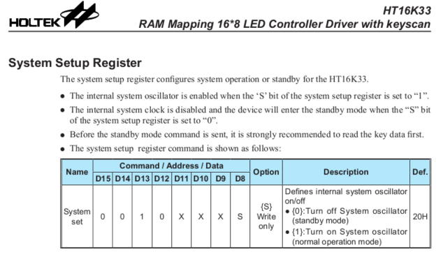
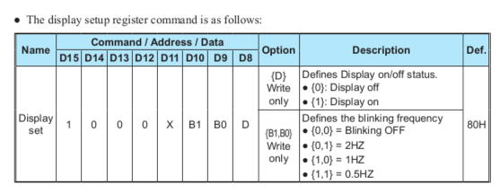
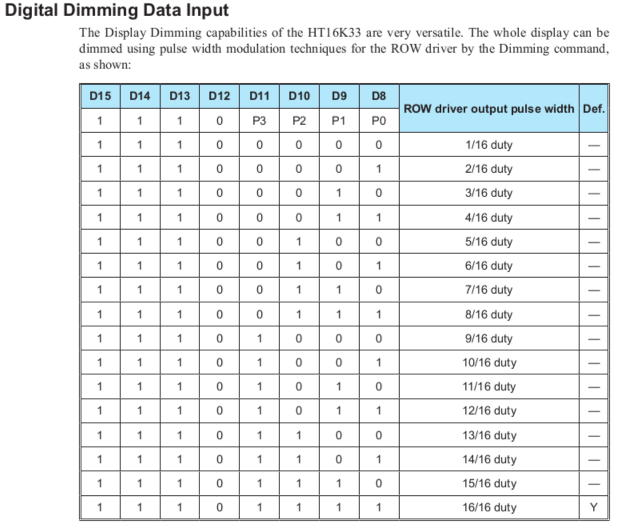
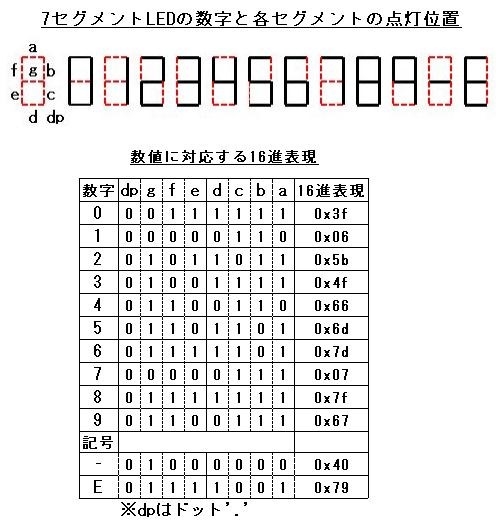
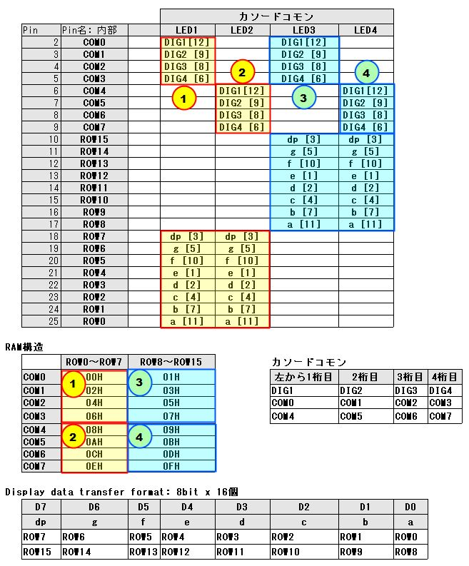

## 1. Pythonプログラミング

* もともとプラグラマー歴 (Java) ２０年以上なのでLEDへの出力プログラムは全てスクラッチで作りました。  
* 4桁7セグLEDの明るさは、明暗切替ボタンで4段階に切り替えするようにしています。  
※HT16K33モジュールは16段階まで替えることができますが、人間の目では4段階で十分です。

### 1-1. HT16K33モジュールのライブラリ作成

* ライブラリを作るには【HT16K33モジュールの仕様書】を読んで理解することが必要です。  
※ひとまずクラスで必要な部分に絞って抜粋します
<div>

</div>
<br/>

* [1] System setup register: 
<div>

</div>
<br/>

* [2] Display setup register:
<div>

</div>
<br/>

* [3] Digital Dimming Data input: 明暗切替クラスに使っている値の元ネタ
<div>

</div>
<br/>

* HT16K33モジュールのベースクラスを作る  
  GPIO制御用のPythonライブラリとして **pigpio** を使用する  
  https://abyz.me.uk/rpi/pigpio/python.html#i2c_open 以下の各関数を参照

* プログラムはLinuxではおなじみのデバイスファイル(**i2cキャラクスデバイス**)への書き込みとなります
```bash
pi@raspi-zero:~ $ ls -l /dev/* | grep i2c | grep -v lrw
crw-rw---- 1 root i2c      89,   1 12月 24 14:29 /dev/i2c-1  # i2cキャラクタデバイス
```

【気象データ表示板と出力制御クラス図】

<div>

</div>
<br/>

【コードの説明】デバックログ出力部分は省略
```
(1) I2Cバスナンバー: ラズパイZero WHは "1" ※上記 i2cキャラクタデバイスの ハイフン"-"後の数字
(2) Brightnessクラスの値と加算するベース定数値: 仕様書[3]の D15-D12の値 (0xe0)
(3) 明度4段階の値を表現するクラス: 仕様書[3]の D11-D08の値
     ・HIGH: 16/16 duty, MID: 9/16 duty, LOW: 5/16 duty, DIM: 3/16 duty
    ※Enum 列挙型でもできるが切替時の計算処理が面倒なのてクラスとした
(4) HT16K33モジュール制御クラス
    ※制御クラスは下記ソースのメソッドだけ十分です。
    (4-0) コンストラクター
    (4-1) pi: pigpioのインスタンス
    (4-2) self.i2c_handle: デバイスファイルをオープンしインスタンスハンドルに設定する
    (4-3) System setup: [1] System setup register ※設定値はソースのコメント参照
    (4-4) Display setup: [2] Display setup register ※設定値はソースのコメント参照
    (4-5) Dimming 設定: インスタンス生成時の明度 (3)クラスの値と(2)とのビット加算
    (4-6) HT16K33モジュールのメモリクリアメソッド
    (4-7) クリーンアップ処理: メモリクリアとレジスタリセット
     ※リセットしない場合はモジュールのレジスタには最後の値が保持される
    (4-8) 使ったデバイスファイルハンドルはクリーンアップ処理でクローズする
    (4-9) HT16K33モジュールに表示データを送信するメソッド
        (4-9-1) 開始メモリをreg変数に保持
           下記 3-2. [2]4個の4桁7セグLEDの配線位置とRAM構造一覧表のRAM構造から
           【開始メモリ】 ①LED1: 00H, ②LED2: 08H, ③LED3: 01H, ④LED4: 09H
        (4-9-2) 引数datasは表示4桁分のリストデータ
        (4-9-3) 1桁分(1バイト)ずつ送信する
        (4-9-4) 開始メモリは2バイトずつ加算する ※RAM構造参照
    (4-10) 明暗ボタン押下毎にこのメソッドを呼び出しします。 
```

* コード本体 [lib/ht16k33.py]
```python
import logging

"""
LEDドライバモジュール(HT16K33)制御クラス for pigpio
"""

BUS_NUM = 1               (1)
BRIGHTNESS_BASE = 0xe0    (2)

class Brightness:         (3)
    HIGH = 0x0f
    MID = 0x08
    LOW = 0x04
    DIM = 0x02


class HT16K33:            (4)
    MEM_LAST = 0x0f

    def __init__(self, pi, slave_addr, bus_number=BUS_NUM, brightness=Brightness.MID, logger=None): (4-0)
        self.pi = pi                                                                (4-1)
        # i2c_handle = /dev/i2c-[BUS_NUM]
        self.i2c_handle = pi.i2c_open(bus_number, slave_addr)                       (4-2)
        self.opened = True
        # System setup: Turn on System oscillator(発振器) [0x20 + 1(on)]
        self.pi.i2c_write_byte(self.i2c_handle, 0x21)                               (4-3)
        # Display setup: Display on [0x80 + 1(on)]
        self.pi.i2c_write_byte(self.i2c_handle, 0x81)                               (4-4)
        # Brightness: [0xe0 + f{1,0,0,0}]
        self.pi.i2c_write_byte(self.i2c_handle, (BRIGHTNESS_BASE | brightness))     (4-5)

    def clear_memory(self):                                                         (4-6)
        for m_addr in range(self.MEM_LAST + 1):
            self.pi.i2c_write_byte_data(self.i2c_handle, m_addr, 0x0)

    def debug_memory(self):
        for m_addr in range(0x0f + 1):
            r_data = self.pi.i2c_read_byte_data(self.i2c_handle, m_addr)

    def cleanup(self):                                                             (4-7)
        # Poweroffでもメモリーの値は残っている
        self.clear_memory()
        # Display setup: Display off
        self.pi.i2c_write_byte(self.i2c_handle, 0x80)
        # System setup: Turn on System oscillator off
        self.pi.i2c_write_byte(self.i2c_handle, 0x20)
        self.pi.i2c_close(self.i2c_handle)                                         (4-8)
        self.opened = False

    # クリーンアップ途中でクローズに失敗した場合に単独で実行
    def force_close(self):
        if self.opened:
            self.pi.i2c_close(self.i2c_handle)

    def send_data(self, start_reg, datas):                                         (4-9)
        # 送信データを下位メモリから送信する
        reg = start_reg                                                            (4-9-1)
        for i in range(len(datas)):                                                (4-9-2)
            val = datas[i]
            self.pi.i2c_write_byte_data(self.i2c_handle, reg, val)                 (4-9-3)
            reg += 0x02                                                            (4-9-4)

    def set_brightness(self, brightness):                                         (4-10)
        self.pi.i2c_write_byte(self.i2c_handle, (BRIGHTNESS_BASE | brightness))
```

### 1-2 (A). 4桁7セグLED出力ライブラリ作成

* [1] 7セグメントLEDへの出力文字[0〜9, -, E]に対応する16進表現一覧

<div>

</div>
<br/>

* [2] 4個の4桁7セグLEDの配線位置とRAM構造一覧表

<div>

</div>
<br/>

【コードの説明】デバックログ出力部分は省略

* カソードコモン4桁7セグLEDの処理に絞って解説します。
* 以降カソードコモン4桁7セグLEDをカソードコモンと表記します。

```
(1) 4桁7セグLEDの桁数の定数定義: 使用する7セグLEDの桁数
(2) 整数値から数値のリストを生成する関数 ※処理内容はコメント通り
(3) アノードコモンに関する関数 ※処理内容はコメント通り
(4) LEDコモン定義クラス
(5) 4個の4桁7セグLEDのうちの何個目の4桁7セグLEDに出力するかを指し示すクラス
(6) HT16K33クラスを継承した4桁7セグLED出力クラス
   (6-1) 上記[1]の一覧表に対応する定義
   (6-2) エラー定義 ※数値以外、又は許容範囲外
   (6-3) 待機中を表す定義 ※データが未到着状態
   (6-4) 上記[2]一覧表の LED1(①)に出力する時のHT16K33のRAM構造の先頭アドレス
   (6-5) 上記[2]一覧表の LED1(②) 同上
   (6-6) 上記[2]一覧表の LED1(③) 同上
   (6-7) 上記[2]一覧表の LED1(④) 同上
   (6-8) カソードコモンのLEDNumberクラス(N1〜N4) と LED1(①)〜LED1(④)に対応するメモリ開始アドレスマップ

(7) _make_digits()関数の戻り値をLED出力用16進数リストに変換するメソッド ※カソードコモン専用
   (例) データが 1234 の場合
      make_digits()の戻り値 [4, 3, 2, 1] -> [0x06 (1), 0x5b (2), 0x4f (3), 0x66 (4)]

(8) 整数データをLED出力用16進数のリストに変換するメソッド ※カソードコモン、アノードコモン両用
   (例) データが 1234 の場合 ※カソードコモン
      1234 -> [4, 3, 2, 1] -> [0x06, 0x5b , 0x4f, 0x66]

(9) 浮動小数点数データ(出力は小数点第1位)をLED出力用16進数のリストに変換するメソッド
   [例1] データが -12.3 の場合
      0. 出力文字リスト:   t_datas = []
      1. 数値がマイナスの場合: t_datas = [0x40], データをプラスにする 12.3
      2. 正の数値を文字列に変換: 12.3 -> "12.3"
      3. 文字列リスト(["1", "2", ".", "3"]分ループの中で出力用数値に変換
        3-1. "1" -> (49-48)=1 -> self.SEG_CHAR[1]: 0x06 -> t_datas = [0x40, 0x06]
        3-2. "2" -> (50-48)=2 -> self.SEG_CHAR[2]: 0x5b -> t_datas = [0x40, 0x06, 0x5b]
        3-3. "."が出現: ひとつ前の数値に128を加算
           t_datas = [0x40, 0x06, (0x5b + 128)] -> [0x40, 0x06, 0xdb]
           ※(1) [1]一覧の【数値に対応する16進表現】の'dp'位置に1をセット
           ※(2) 0x5b:[0,1,0,1,1,0,1,1] -> 0xdb:[1,1,0,1,1,0,1,1]
        3-4. "3" -> (51-48)=3 -> self.SEG_CHAR[3]: 0x4f -> t_datas = [0x40, 0x06, 0xdb, 0x4f]
      4. ドットの出現有無判定でドットが出現するので処理をスキップ
      5. 出力用4桁バッファに逆順に格納しなおす
        datas = [0x4f, 0xdb, 0x06, 0x04] 
   [例2] データが 35 の場合
      0.〜3.の処理で: t_datas = [0x4f, 0x6d]
      4. ドットの出現有無判定でドットが出現しない
        4-1. 末尾の数値に128を加算
          t_datas = [0x4f, (0x6d + 128)] -> t_datas = [0x4f, 0xed]
        4-2. 最後に小数点以下のゼロを補う ※小数点以下のゼロを表示する仕様とする
          t_datas = [0x4f, 0xed, 0x3f]
      5. 出力用4桁バッファに逆順に格納しなおす
        datas = [0x3f, 0xed, 0x0f] 
   6. datasを関数の戻り値として返却

(10) 浮動小数点数データ出力メソッド
   1. 浮動小数点数データの範囲チェック: 気温データのみマイナス有り、小数点以下1位
     4桁7セグlEDは4桁しか出力できないので-99.9未満、999.9超はNG 
     1-1. 範囲外なら[0x79, 0x79, 0x79, 0x79] (出力: E|E|E|E)
   2. Led_numの値によりHT16K33モジュールの先頭RAMメモリアドレスを決定
   3. インスタンスのデータ送信メソッドsend_data()を実行

(11) 整数データ出力メソッド
(12) スタンバイ状態出力メソッド
(13) 測定値エラー出力力メソッド
```

[bin/lib/led4digit7seg.py]

```python
import logging
from enum import Enum
from .ht16k33 import HT16K33, BUS_NUM

DIGIT = 4                                                    (1)


def _make_digits(number):                                    (2)
    """
    数値を数字のリストに変換する (リストは逆順になる)
    (例) 123 ->  [3, 2, 1]
    :param number: 数値(最大4桁の整数 or マイナスの場合は3桁)
    :return: 数値を逆順にした数字のリスト
    """
    digits = []
    num, mod = number, 0
    for _ in range(DIGIT):
        num, mod = divmod(num, 10)
        digits.append(mod)
        if num == 0:
            break
    return digits


def _to_bins(val):                                           (3)
    """
    数値の2進数計算 ※アノードコモンのみ
    :param val:数値
    :return: 2進数のリスト
    """
    # 配列は8bit分初期化
    bins = [0] * 8
    num, mod = val, 0
    for i in range(8):
        num, mod = divmod(num, 2)
        bins[i] = mod
        if num == 0:
            break
    # ビット計算用に逆順にする
    return bins[::-1]


class LEDCommon(Enum):                                      (4)
    CATHODE = 0
    ANODE = 1


class LEDNumber(Enum):                                      (5)
    N1 = 0
    N2 = 1
    N3 = 2
    N4 = 3


class LED4digit7Seg(HT16K33):                                                  (6)
    # 表示文字定義: [0, 1, 2, 3, 4, 5, 6, 7, 8, 9]
    SEG_CHAR = [0x3f, 0x06, 0x5b, 0x4f, 0x66, 0x6d, 0x7d, 0x07, 0x7f, 0x67]    (6-1)
    # ハイフン:'-'
    SEG_MINUS = 0x40                                                           (6-1)
    # エラー:'EEEE'
    SEG_ERRORS = [0x79] * DIGIT                                                (6-2)
    # 測定不能:'----'
    SEG_OUTOFRANGE = [SEG_MINUS] * DIGIT                                       (6-3)
    # [LED1] DIG1:COM0(0x00),DIG2:COM1(0x02),DIG3:COM2(0x04),DIG4:COM3(0x06)
    #        ROW7(dp[3]), ROW6(g[5]), ROW5(f[10]), ROW4(e[1]), ROW3(d[2]), ROW2(c[4]), ROW1(b[7]), ROW0(a[11])
    REG_LED1 = 0x00                                                            (6-4)
    # [LED2] DIG1:COM4(0x08),DIG2:COM5(0x0A),DIG3:COM6(0x0C),DIG4:COM7(0xEH)
    #        ROW7, ROW6(D6),..., ROW1, ROW0
    REG_LED2 = 0x08                                                            (6-5)
    # [LED3] DIG1:COM0(0x01),DIG2:COM1(0x03),DIG3:COM2(0x05),DIG4:COM3(0x07)
    #        ROW15(dp[3]), ROW14(g[5]), ROW13(f[10]), ROW12(e[1]), ROW11(d[2]), ROW10(c[4]), ROW9(b[7]), ROW8(a[11])
    REG_LED3 = 0x01                                                            (6-6)
    # [LED4] DIG1:COM4(0x09),DIG2:COM5(0x0B),DIG3:COM6(0x0D),DIG4:COM7(0xFH)
    #        ROW15, ROW14,..., ROW9, ROW8
    REG_LED4 = 0x09                                                            (6-7)
    # アノードコモン
    REG_ANODE_LED1 = REG_LED1
    REG_ANODE_LED2 = REG_LED3
    # メモリ開始アドレスマップ
    STAREG_CATHODE = {LEDNumber.N1: REG_LED1, LEDNumber.N2: REG_LED2, LEDNumber.N3: REG_LED3, LEDNumber.N4: REG_LED4}                                                                  (6-8)
    STAREG_ANODE = {LEDNumber.N1: REG_ANODE_LED1, LEDNumber.N2: REG_ANODE_LED2}

    def __init__(self, pi, slave_addr, bus_number=BUS_NUM, common=LEDCommon.CATHODE,
                 brightness=None, logger=None):
        super().__init__(pi, slave_addr, bus_number, brightness=brightness, logger=logger)
        self.common = common
        self.logger = logger
        self.debug_once = logger is not None

    def _make_int_datas(self, digits):           (7)
        # カソードコモンLED用
        datas = [0] * DIGIT
        # 数値列(入力値の逆順で4桁目が先頭)を送信データの4桁目から格納する
        elem = DIGIT - 1
        for i in range(len(digits)):
            datas[elem] = self.SEG_CHAR[digits[i]]
            elem -= 1
        return datas

    def _convert_anode(self, cathode_datas):
        # カソードコモンLED用データをアノードコモンLED用に変換
        datas = [0] * 8
        for row in range(len(cathode_datas)):
            val = cathode_datas[row]
            val_bins = _to_bins(val)
            # 8bit分: D7,D6,D5,D4, D3, D2, D1, D0
            #          0, 0, 0, 0, <<3,<<2,<<1,<<0
            for com_j in range(8):
                datas[com_j] = datas[com_j] | (val_bins[com_j] << (3 - row))
        return datas

    def _generate_int_datas(self, number):       (8)
        digits = _make_digits(number)
        datas = self._make_int_datas(digits)
        if self.common == LEDCommon.ANODE:
            # アノードコモンLEDに変換
            datas = self._convert_anode(datas)
        return datas

    def _generate_float_datas(self, float_val):  (9)
        t_datas = []
        # 数値が負なら先頭にマイナスのLED表現をセット
        if float_val < 0:
            t_datas.append(self.SEG_MINUS)
            # マイナス符号を除去
            float_val *= -1
        # 浮動小数点の場合は文字列に変換 ※小数点1桁で4捨5入
        s_val = str(round(1.0 * float_val, 1))
        has_dot = False
        for s in list(s_val):  # 数値文字列をリストに変換
            if s == '.':
                # ドットが出現したら前の数値に128をプラス
                t_datas[len(t_datas) - 1] += 128
                has_dot = True
                continue

            # ドット以外は数値
            t_datas.append(self.SEG_CHAR[ord(s) - 48])  # '0': 48, '1':49, ...

        # ドットの出現有無判定
        if not has_dot:
            # 出現しなかったら配列末尾の数値表現+128
            t_datas[len(t_datas) - 1] += 128
            # 小数点以下のゼロを補う
            t_datas.append(self.SEG_CHAR[0])

        # 出力用4桁バッファに逆順に格納しなおす
        datas = [0] * DIGIT
        pos = DIGIT
        for i in range(len(t_datas) - 1, -1, -1):
            pos -= 1
            datas[pos] = t_datas[i]
        return datas

    def printFloat(self, float_val, led_num=LEDNumber.N1):　(10)
        if float_val < -99.9 or float_val > 999.9:
            datas = self.SEG_OUTOFRANGE
        else:
            datas = self._generate_float_datas(float_val)
            if self.common == LEDCommon.ANODE:
                # アノードコモン: アノードコモン用のデータに変換
                datas = self._convert_anode(datas)
        stareg = self.STAREG_CATHODE[led_num] if self.common == LEDCommon.CATHODE else self.STAREG_ANODE[led_num]
        self.send_data(stareg, datas)

    def printInt(self, int_val, led_num=LEDNumber.N1):     (11)
        if int_val < -999 or int_val > 9999:
            datas = self.SEG_OUTOFRANGE
        else:
            datas = self._generate_int_datas(int_val)
        stareg = self.STAREG_CATHODE[led_num] if self.common == LEDCommon.CATHODE else self.STAREG_ANODE[led_num]
        self.send_data(stareg, datas)

    def printOutOfRange(self, led_num=LEDNumber.N1):       (12)
        """
        範囲外: '----'
        :param led_num: 出力先LED
        """
        stareg = self.STAREG_CATHODE[led_num] if self.common == LEDCommon.CATHODE else self.STAREG_ANODE[led_num]
        self.send_data(stareg, self.SEG_OUTOFRANGE)

    def printError(self, led_num=LEDNumber.N1):            (13)
        """
        測定値エラー: 'EEEE'
        :param led_num: 出力先LED
        """
        stareg = self.STAREG_CATHODE[led_num] if self.common == LEDCommon.CATHODE else self.STAREG_ANODE[led_num]
        self.send_data(stareg, self.SEG_ERRORS)
```

### 1-2 (B). 時刻出力ライブラリ作成

時刻の出力は５桁固定なので出力処理は非常に簡単になります。
```  
Unixタイムスタンプ -> 時刻文字列生成: 時(２桁) + ":" + 分(２桁)
(コード例)
str_time = datetime.fromtimestamp(unix_tmstmp).strftime("%H:%M")
```

[lib/timeled7seg.py]
```python
import logging
from datetime import datetime
from .ht16k33 import HT16K33, BUS_NUM

"""
LEDドライバモジュール(HT16K33)を使ったコロン付き4桁7セグメントの時刻表示ライブラリ
"""


class LEDTime(HT16K33):
    DIGIT = 5
    # 表示文字定義: ['0', '1', '2', '3', '4', '5', '6', '7', '8', '9', ':']
    SEG_CHAR_MAP = {
        '0': 0x3f, '1': 0x06, '2': 0x5b, '3': 0x4f, '4': 0x66,
        '5': 0x6d, '6': 0x7d, '7': 0x07, '8': 0x7f, '9': 0x67,
        ':': 0x02
    }

    # DIG1:COM0(0x00),DIG2:COM1(0x02),COLON:COM2(0x04),DIG3:COM3(0x06),DIG4:COM4(0x08)
    REG_START_ADDR = 0x00
    # コロン付きLEDのスタンバイ: '--:--'
    SEG_STANDBY = [0x40, 0x40, 0x02, 0x40, 0x40]
    # コロン付きLEDのエラー: 'EE:EE'
    SEG_ERRORS = [0x79, 0x79, 0x02, 0x79, 0x79]

    def __init__(self, pi, slave_addr, bus_number=BUS_NUM, brightness=None, logger=None):
        super().__init__(pi, slave_addr, bus_number, brightness=brightness, logger=logger)
        self.logger = logger
        self.debug_once = logger is not None and (logger.getEffectiveLevel() <= logging.DEBUG)

    def _make_display_time(self, unix_tmstmp: int):
        """
        UnixタイムスタンプからLED出力用のデータを生成する
        :param unix_tmstmp:
        :return:
        """
        datas = [0] * self.DIGIT
        str_time = datetime.fromtimestamp(unix_tmstmp).strftime("%H:%M")
        i = 0
        for tm in str_time:
            datas[i] = self.SEG_CHAR_MAP[tm]
            i += 1
        return datas

    def set_brightness(self, brightness):
        # 明るすぎるため調整する: 設定する明るさの1/2をマイナス
        # ※最小値は1でマイナスになることはない
        brightness -= (brightness // 2)
        super().set_brightness(brightness)

    def printTime(self, unix_tmstmp: int):
        """
        Unixタイムスタンプからの時刻を表示する
        :param unix_tmstmp: Unixタイムスタンプ
        """
        datas = self._make_display_time(unix_tmstmp)
        self.send_data(self.REG_START_ADDR, datas)

    def printError(self):
        """
        エラー表示: 'EE:EE'
        """
        self.send_data(self.REG_START_ADDR, self.SEG_ERRORS)

    def printStandby(self):
        """
        準備中表示: '--:--'
        """
        self.send_data(self.REG_START_ADDR, self.SEG_STANDBY)
```


### 1-3. UDPパケット(気象データ)モニターアプリ

* アプリケーションメイン  
  ※4桁7セグLED出力処理部分に限定して説明します。

```
(1) グローバル定義
   (1-1.A) LED4digit7Seg インスタンス変数
   (1-1.B) LEDTime インスタンス変数
   (1-2) 明暗切替えボタン用コールバック変数
   (1-3) 明暗切替えボタン用の循環Dict(明->中->低->暗->明..[循環])
(2) 明暗ボタン押下コールバック
   (2-1) チャタリング防止処理 ※タクトボタン押下時に連続して発生することが多い
   (2-2) LED4digit7Segインスタンスの明度設定メソッドを呼び出す
(3) 明暗切替えボタン用コールバック生成
(4-1) 4個全てのLEDに '----' を出力 ※ラズパイ起動直後のスタンバイ表示
(4-2) 4個全てのLEDに 'EEEE' を出力 ※UDPパケットに無効なデータが含まれていた場合の表示
(5) 4個の4桁7セグLEDに気象データを出力する関数 ※以下「4桁7セグLED」を「LED」と記載
   (5-1) 外気温を1番目のLEDに出力 ※小数点以下1桁
   (5-2) 室内気温を2番目のLEDに出力 ※小数点以下1桁
   (5-3) 室内湿度を3番目のLEDに出力 ※小数点以下1桁
   (5-4) 室内気圧を4番目のLEDに出力 ※4桁整数
(6) メインループ処理
   (6-1) 無限ループ ※ラズパイをシャットダウンしない限り処理し続ける
   (6-2) ESP-WROOM-02からのUDPパケットを受信し、気象データ(バイナリーデータ)を取得する
   (6-3) バイナリーデータを"UTF-8"でデコードして文字列化する
         文字列化した気象データの形式: "デバイスID, 外気温, 室内気温, 室内湿度, 室内気圧"
   (6-4) 文字列化した気象データを分解して配列データにセット
        配列データ ["デバイスID", "外気温", "室内気温", "室内湿度", "室内気圧"]
   (6-5.A) 最初のデバイスIDを除いた配列データをLED出力関数に設定する
   (6-5.B) バケット到着時刻をデータの測定時刻とし、時刻表示LEDに出力する
(7) アプリケーションメイン処理
   (7-1) UDPソケットクライアントインスタンス生成
   (7-2) (7-1)インスタンスにブロードキャストアドレス(引数[--udp-port]から取得)をバインドする
   (7-3) カレントLED明暗変数にデフオルト値[明]を設定
   (7-4.A) LED4digit7Segクラスのインスタンス生成【スレーブアドレス】 0x71
   (7-4.B) LEDTimeクラスのインスタンス生成【スレーブアドレス】 0x70
   (7-5.A) (7-4.A)インスタンスの処理化処理実行
   (7-5.B) (7-4.B) 同上
   (7-6.A) 4個のLEDのスタンバイ状態表示を出力 ("----")
   (7-6.B) 時刻表示LEDのスタンバイ状態表示を出力 ("--:--")
   (7-7) GPIOの初期化処理実行
   (7-8) メインループ処理実行
```

* ソースコード [bin/UDPClientFromWeahter.py]  
  ※1 デバックログ出力は除いています  
  ※2 LED出力に関する処理部分のみ説明します  
  ※3 **時刻表示LEDの追加と対応する処理コード追加 (2022-10-03)**

```python
import argparse
import logging
import os
import pigpio
import signal
import socket
import subprocess
import threading
import time
from datetime import datetime
from urllib.parse import quote_plus
import db.weatherdb as wdb
import util.file_util as FU
from mail.gmail_sender import GMailer
from lib.ht16k33 import Brightness, BUS_NUM
from lib.led4digit7seg import LED4digit7Seg, LEDCommon, LEDNumber
from lib.timeled7seg import LEDTime
from log import logsetting

# Global instance
pi = None
# first HT16K33 driver for measurement data display LEDs (1-1.A)
led_driver = None
# Second HT16K33 driver for mesurement time display LED  (1-1.B)
time_led_driver = None
udp_client = None
# Global flag
led_available = False
# Callback brightness switch
cb_brightness = None                                 (1-2)
curr_brightness = None
# Prevent chattering
prev_tick = 0
THRESHOLD_DIFF_TICK = 500000


# Dict for next brightness: HIGH > MID > LOW > DIM
NextBrightness = {Brightness.HIGH: Brightness.MID,
                  Brightness.MID: Brightness.LOW,
                  Brightness.LOW: Brightness.DIM,
                  Brightness.DIM: Brightness.HIGH}   (1-2)


def change_brightness(gpio_pin, level, tick):        (2)
    """
    Change LED brightness.
    :param gpio_pin: Brightness GPIO pin number
    :param level: level
    :param tick: tick time.
    """
    global curr_brightness, prev_tick
    if prev_tick != 0:
        tick_diff = pigpio.tickDiff(prev_tick, tick)
        if tick_diff < THRESHOLD_DIFF_TICK:               # (2-1)
            return

    prev_tick = tick
    next_brightness = NextBrightness[curr_brightness]
    if curr_brightness != next_brightness:
        curr_brightness = next_brightness
        # data EDs
        led_driver.set_brightness(next_brightness)        # (2-2)
        # time LED
        time_led_driver.set_brightness(next_brightness)


def setup_gpio():
    """ Tact button for brightness adjustment. """
    global cb_brightness
    pi.set_mode(BRIGHTNESS_PIN, pigpio.INPUT)
    pi.write(BRIGHTNESS_PIN, pigpio.LOW)
    # Set internal pull-down register.
    pi.set_pull_up_down(BRIGHTNESS_PIN, pigpio.PUD_DOWN)
    # SW OFF(LOW) -> ON(HIGH)
    cb_brightness = pi.callback(BRIGHTNESS_PIN, pigpio.RISING_EDGE, change_brightness)   (3)


def cleanup():
    """ GPIO cleanup, and UDP client close. """
    if cb_brightness is not None:
        cb_brightness.cancel()
    if led_driver is not None:
        # Check i2c connect.
        if not has_led_i2c_error:
            led_driver.cleanup()
    if time_led_driver is not None:
        if not has_led_i2c_error:
            time_led_driver.cleanup()
    pi.stop()
    udp_client.close()


def data_led_standby():                                         (4-1)
    """ Initialize all LEDs to '----' """
    led_driver.printOutOfRange(led_num=LEDNumber.N1)
    led_driver.printOutOfRange(led_num=LEDNumber.N2)
    led_driver.printOutOfRange(led_num=LEDNumber.N3)
    led_driver.printOutOfRange(led_num=LEDNumber.N4)


def led_notification():                                    (4-2)
    """ Notification all LEDs to 'EEEE' """
    led_driver.printError(led_num=LEDNumber.N1)
    led_driver.printError(led_num=LEDNumber.N2)
    led_driver.printError(led_num=LEDNumber.N3)
    led_driver.printError(led_num=LEDNumber.N4)

def output_led(temp_out, temp_in, humid, pressure):             (5)
    """
    Output measurement values to LED.
    :param temp_out: Outer temperature value
    :param temp_in: Inner temperature value
    :param humid: Inner humidity value
    :param pressure: Inner pressure value
    """
    if not isfloat(temp_out):
        led_driver.printError(led_num=LEDNumber.N1)
    else:
        val = float(temp_out)
        if not valid_temp(val):
            led_driver.printOutOfRange(led_num=LEDNumber.N1)
        else:
            led_driver.printFloat(val, led_num=LEDNumber.N1)    (5-1)
    # LED2: Inner temperature
    if not isfloat(temp_in):
        led_driver.printError(led_num=LEDNumber.N2)
    else:
        val = float(temp_in)
        if not valid_temp(val):
            led_driver.printOutOfRange(led_num=LEDNumber.N2)
        else:
            led_driver.printFloat(val, led_num=LEDNumber.N2)    (5-2)
    # LED3: humidity
    if not isfloat(humid):
        led_driver.printError(led_num=LEDNumber.N3)
    else:
        val = float(humid)
        if not valid_humid(val):
            led_driver.printOutOfRange(led_num=LEDNumber.N3)
        else:
            led_driver.printFloat(val, led_num=LEDNumber.N3)    (5-3)
    # LED4: pressure(interger)
    if not isfloat(pressure):
        led_driver.printError(led_num=LEDNumber.N4)
    else:
        val = float(pressure)
        val = int(round(val, 0))
        if not valid_pressure(val):
            led_driver.printOutOfRange(led_num=LEDNumber.N4)
        else:
            led_driver.printInt(val, led_num=LEDNumber.N4)      (5-4)


def loop(client):                                               (6)
    """
    Infinit UDP packet monitor loop.
    :param client: UDP socket
    """
    global delayed_mail_sent
    server_ip = ''
    # Timeout setting
    client.settimeout(RECV_TIMEOUT)
    while True:                                                            (6-1)
        try:
            data, addr = client.recvfrom(BUFF_SIZE)                        (6-2)
        except socket.timeout:
            logger.warning("Socket timeout!")
            now = datetime.now()
            if delayed_mail_sent is not None:
                if conf_subprocess["playMelody"]["enable"]:
                    melody_thread = threading.Thread(target=subproc_playmelody)
                    logger.warning("Subprocess PlayMelody thread start.")
                    melody_thread.start()

                # Send Gmail: Read every occurence
                (is_sendmail, subject, content_template, recipients) = mail_config()
                if is_sendmail:
                    delayed_now = now.strftime('%Y-%m-%d %H:%M')
                    content = content_template.format(delayed_now)
                    mail_thread = threading.Thread(target=send_mail, args=(subject, content, recipients,))
                    logger.warning("Mail Thread start.")
                    mail_thread.start()
                delayed_mail_sent = True
            continue

        if server_ip != addr:
            server_ip = addr

        # Reset flag.
        if delayed_mail_sent:
            delayed_mail_sent = False
        # From ESP output: device_name, temp_out, temp_in, humid, pressure
        line = data.decode("utf-8")                                       # (6-3)
        record = line.split(",")                                          # (6-4)
        # Insert weather DB with local time
        # unix_tmstmp = int(time.time())   # time.time() is UTC unix epoch
        local_time = time.localtime()
        unix_tmstmp = time.mktime(local_time)
        wdb.insert(*record, measurement_time=unix_tmstmp, logger=logger)

        # output 4Digit7SegLED
        if led_available:
            try:
                # measurement time display LED: from Unix Timestamp
                time_led_driver.printTime(unix_tmstmp)                    # (6-5.B)
                # data LED(4 unit)
                output_led(record[1], record[2], record[3], record[4])    # (6-5.A)
            except Exception as i2c_err:
                has_led_i2c_error = True
                logger.warning(i2c_err)
                # Display at onece.
                if i2c_error_count == 0:
                    # Show I2C Error at once.
                    try:
                        led_show_i2cerror()
                    except Exception as e:
                        pass
                    # Output OLED display
                    time_now = now.strftime('%H:%M')
                    display_thread = threading.Thread(target=subproc_displaymessage, args=("i2c-error", time_now,))
                    logger.warning("Subprocess DisplayMessage thread start.")
                    display_thread.start()
                i2c_error_count += 1
                logger.warning("I2C error count: {} at {}".format(i2c_error_count, time_now))


if __name__ == '__main__':         (7)
    pi = pigpio.pi()
    if not pi.connected:
        logger.warning("pigpiod not stated!")
        exit(1)

    parser = argparse.ArgumentParser()
    parser.add_argument("--udp-port", type=int, default=WEATHER_UDP_PORT, help="Port from UDP Server[ESPxx].")
    parser.add_argument("--brightness-pin", type=int, default=BRIGHTNESS_PIN, help="Brightness change SW Pin.")
    args = parser.parse_args()
    logger.info(args)

    signal.signal(signal.SIGTERM, detect_signal)
    BRIGHTNESS_PIN = args.brightness_pin
    # Gmail sendor for Weather sensors UDP packet delay notification
    mailer = GMailer()
    hostname = socket.gethostname()
    # Receive broadcast
    broad_address = ("", args.udp_port)
    logger.info("{}: {}".format(hostname, broad_address))
    # UDP client
    udp_client = socket.socket(socket.AF_INET, socket.SOCK_DGRAM)     # (7-1)
    udp_client.bind(broad_address)                                    # (7-2)
    # HT16k33 connection check
    led_available = has_i2cdevice(I2C_ADDRESS)
    # LED for displaying measurement data
    if led_available:
        curr_brightness = Brightness.HIGH                             # (7-3)
        # measurement data display LEDs
        led_driver = LED4digit7Seg(
            pi, 
            I2C_ADDRESS,                                        # スレーブアドレス: 0x71
            common=LEDCommon.CATHODE, 
            brightness=curr_brightness, 
            logger=None
        )                                                             # (7-4.A)                     
        led_driver.clear_memory()                                     # (7-5.A)
        # measurement time(packet received) display LED
        time_led_driver = LEDTime(
            pi,
            TIME_I2C_ADDRESS,                                   # スレーブアドレス: 0x70
            brightness=curr_brightness,
            logger=None
        )                                                            # (7-4.B)
        time_led_driver.clear_memory()                               # (7-5.B)
        # スタンバイ表示
        # 測定値表示LEDs
        data_led_standby()                                            # (7-6.A)
        # 時刻表示LDE
        time_led_driver.printStandby()                                # (7-6.B)
        # GPIO pin setting for brightness adjustment
        setup_gpio()                                                  # (7-7)
    try:
        loop(udp_client)                                              # (7-8)
    except KeyboardInterrupt:
        pass
    finally:
        cleanup()
```

[**>>>トップベージ<<<** に戻る](../README.md#2-2-気象データ表示板)
